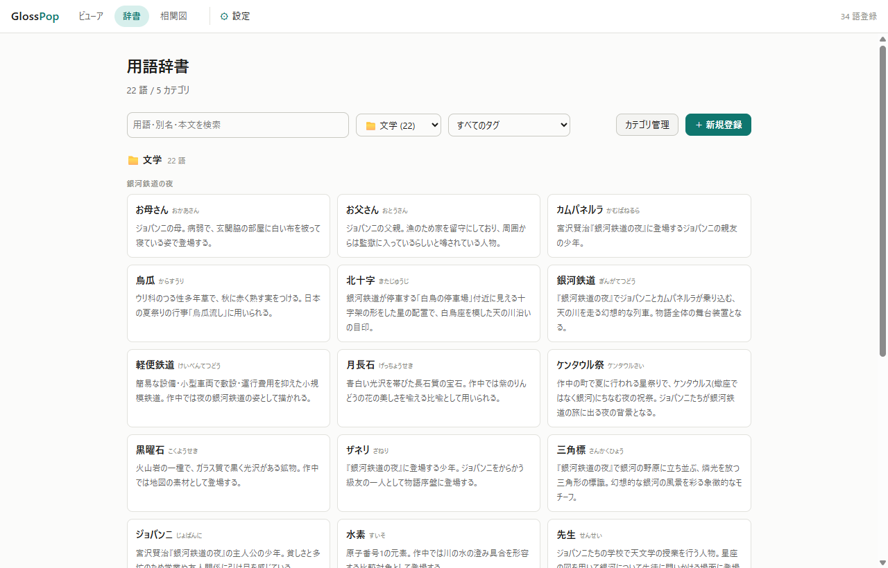
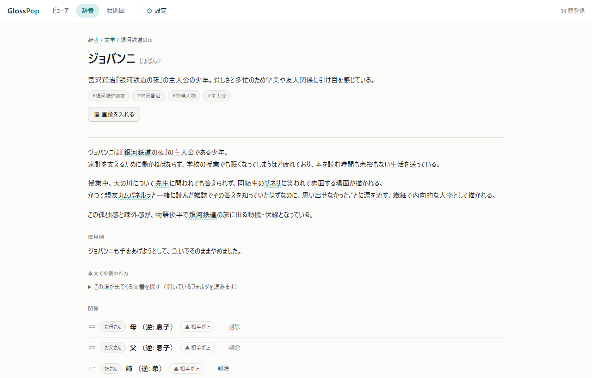
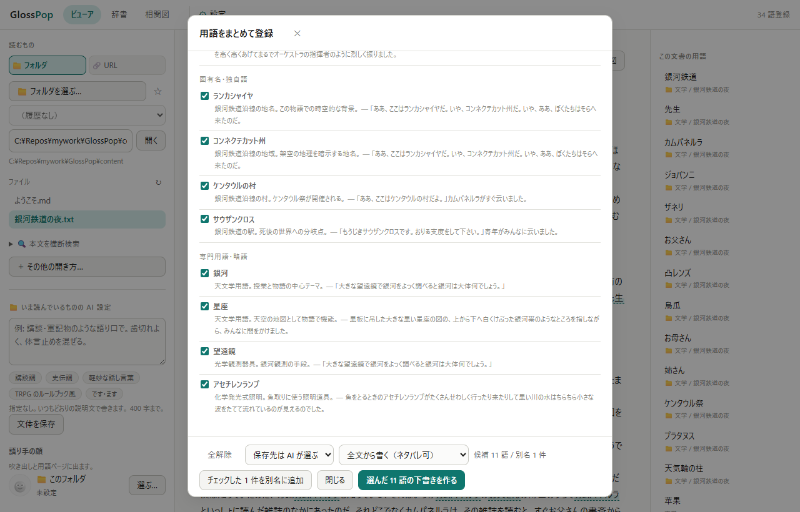
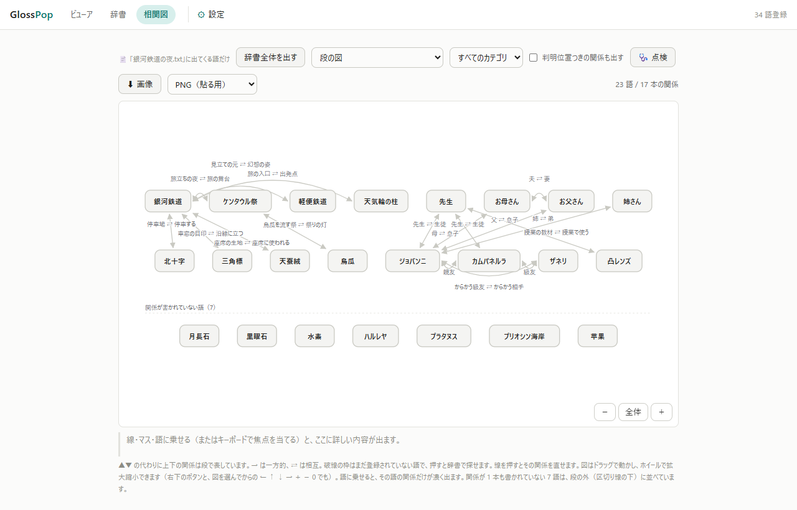
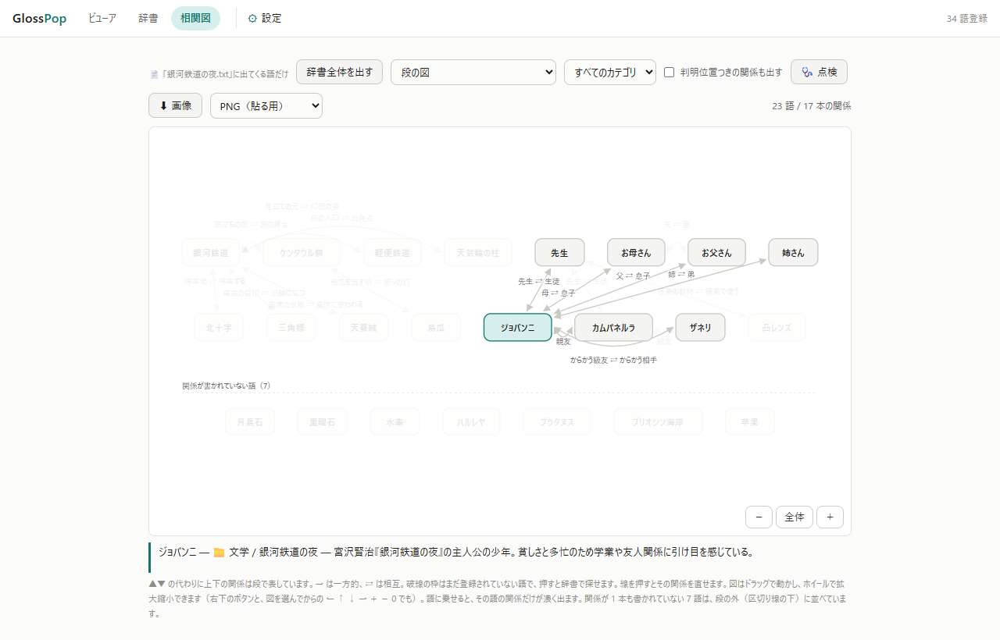
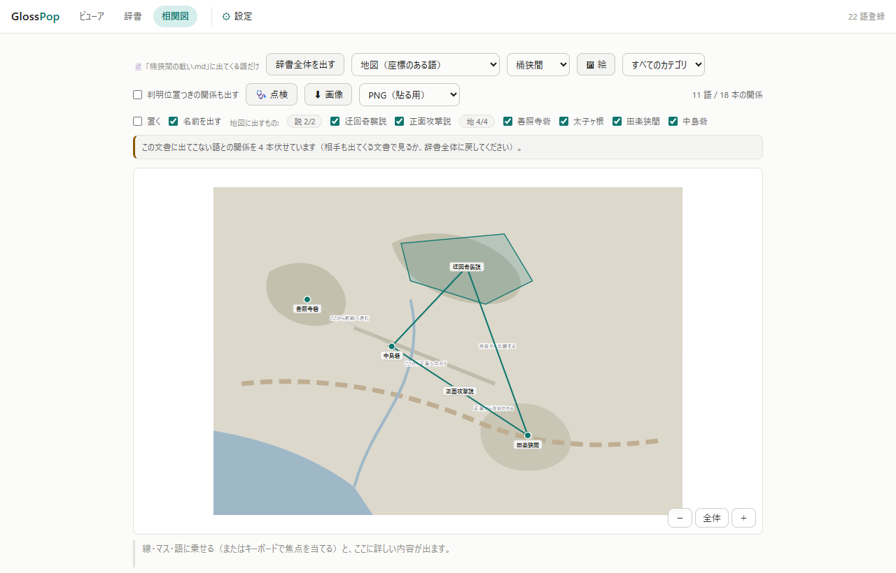

# GlossPop マニュアル

できることの全部。入手と起動だけなら [README](README.md) で足りる。
開発・ビルド・リリースは [DEVELOP.md](DEVELOP.md)。

## 目次

- [AI 下書きについて](#ai-下書きについて)
- [使いかた](#使いかた)
  - [読むものを選ぶ場所（上のバー）と、左パネル](#読むものを選ぶ場所上のバーと左パネル)
  - [画面は重なる（読んでいるものを閉じない）](#画面は重なる読んでいるものを閉じない)
  - [読み上げる](#読み上げる)
  - [続きから読む](#続きから読む)
  - [目次から辿る（epub / pdf）](#目次から辿るepub--pdf)
  - [本文を横断して探す](#本文を横断して探す)
  - [ビューアで登録する](#ビューアで登録する)
  - [まとめて登録する](#まとめて登録する)
  - [フォルダを開く](#フォルダを開く)
  - [フォルダ辞書（ローカル辞書）](#フォルダ辞書ローカル辞書)
  - [URL ごとの辞書](#url-ごとの辞書)
  - [ネタバレを防ぐ（小説の人物辞書など）](#ネタバレを防ぐ小説の人物辞書など)
  - [本文での使われ方（使用例を拾う）](#本文での使われ方使用例を拾う)
  - [関係を図で見る](#関係を図で見る)
    - [見方は 6 つある](#見方は-6-つある)
  - [索引（語がどこに出てくるか）](#索引語がどこに出てくるか)
  - [冊子として書き出す](#冊子として書き出す)
  - [辞書の点検](#辞書の点検)
  - [文書内のリンク](#文書内のリンク)
  - [URL を開く](#url-を開く)
  - [Claude Code から登録する](#claude-code-から登録する)
- [データの形](#データの形)
  - [カテゴリ](#カテゴリ)
  - [割れてしまった同じものをまとめる](#割れてしまった同じものをまとめる)
  - [本文の改行](#本文の改行)
- [自動リンクの規則](#自動リンクの規則)
  - [対象になる場所](#対象になる場所)
  - [装飾をまたぐ照合](#装飾をまたぐ照合)
- [設定](#設定)
  - [データの保存先](#データの保存先)
  - [辞書の書き出し / 取り込み](#辞書の書き出し--取り込み)
  - [使う AI（モデルと思考の深さ）](#使う-aiモデルと思考の深さ)
  - [文体（口調）](#文体口調)
    - [語り手の顔](#語り手の顔)
    - [用語ごとの画像](#用語ごとの画像)
  - [表示テーマ](#表示テーマ)
  - [文字の大きさ](#文字の大きさ)
  - [更新のお知らせ](#更新のお知らせ)
  - [環境変数](#環境変数)
- [更新のしかた](#更新のしかた)
  - [アプリに持ってきてもらう](#アプリに持ってきてもらう)
  - [手で展開する](#手で展開する)
  - [更新したら辞書が空になっていたら](#更新したら辞書が空になっていたら)

## AI 下書きについて

**[Claude Code CLI](https://claude.com/claude-code) を入れておくことを強く勧める。**
下書き・抽出・関係の下書きはこれで動く。`claude` が PATH にあり一度ログインしてあれば、
**GlossPop 側の設定は要らない**（API キーも不要 —— CLI の認証をそのまま使う）。

もう一方の Gemini API も使えるが、**Google AI Studio で API キーを発行して ⚙ に貼る**
必要がある。手順を踏める人向けなので、迷うなら Claude Code CLI にすること。
どちらを使うかは **⚙ の「AI」タブ**で選ぶ（→ [使う AI](#使う-aiモデルと思考の深さ)）。

**どちらも無くても GlossPop は動く。** AI を使う機能（✨ の下書き・用語の抽出・関係の
下書き）だけが無効になり、手で書いて登録するぶんには支障はない。

**exe 版に `claude` は同梱されない**ので、使うなら別に入れること。

## 使いかた

### 読むものを選ぶ場所（上のバー）と、左パネル

**「読むもの」は上の横一列 1 行**（topbar のすぐ下）、**左パネルは 🔍 と
ファイル一覧**。フォルダのパスは横に長い（`C:\...\小説\銀河鉄道`）ので、
幅 280px の縦のパネルに置くと折り返して、いちばん使うファイル一覧を下へ
押し下げていた。

**読むもの** は **📁 フォルダ** と **🔗 URL** のタブで、**どちらか一方しか読めない**
（フォルダを開いたまま Web を読むと、小説の登場人物名が無関係なページでリンクになる）。
**開いたものに合わせてタブは自動で切り替わる**ので、いま効いているのがどちらの辞書かは
常に画面から読める。選んだタブは覚えている。

- **📁 フォルダ** — 📁 選ぶ… / お気に入り ☆ / 最近開いた ▾ /
  **パスの入力欄**（行の残りを全部取る。開いているフォルダがそこに入っている）
- **🔗 URL** — URL を入れて開く。その URL に効く辞書の範囲もここで作る

**バーは 1 行**（1280px で約 45px）。ここに並ぶのは**毎回使うものだけ**で、
残りは次のように散らしてある:

| もの | 置き場所 | なぜ |
| --- | --- | --- |
| **＋ その他の開き方…** | バーの **⋯** | たまにしか使わないのに 130px 占めていた |
| **🔍 本文を横断検索** | **左パネルの 1 行目** | 結果が左に出るので、入口も同じ場所がよい |
| 文体・語り手の顔 | **⚙ の AI タブ** | 全体と 📁 が並んでいて優先順まで読める |

下の行が出るのは**入力欄から読めないことがあるときだけ** —— 既定のフォルダを
開いているとき、辞書が親フォルダにあるとき、エラーのとき。

**⌃ で畳める**（覚えます）。畳むと「📁 いま開いているもの」と **⌄** だけが残る
1 行（約 28px）になる —— 読む面積は縦がすべてなので、要らないときは畳んでよい。

**＋ その他の開き方** は、**ファイルを 1 つだけ開く**と**テキストを貼り付ける**の 2 つ。
どちらも「たまたま手元にあるものを 1 回見る」ための入口なので、読み続けるための入口
（フォルダ / URL）とは分けてある。**ドロップは今までどおりウィンドウのどこでも効く**
（このダイアログを開く必要はない）。

**左パネルは 🔍 とファイル一覧**。探すと結果が一覧と入れ替わり、**← 一覧** で戻る
（どちらも「開く候補の一覧」なので、同じ場所に出したほうが本文との往復が短い）。

[文体（口調）](#文体口調)と[語り手の顔](#語り手の顔)、本文の見せ方（テーマ・
**文字の大きさ**・**各用語の最初の 1 回だけリンク**）は、どれも **⚙** にある
（AI タブ / 表示タブ）。AI タブには**全体と 📁 の両方**が並ぶので、
どちらが優先されるかもそこで読める。

### 画面は重なる（読んでいるものを閉じない）

**辞書・用語ページ・図・点検は、ビューアの上に重なって開く。** 上部の
「辞書」「図」を押しても、吹き出しから辞書ページへ飛んでも、**読んでいた本文は
下に残ったまま**。**✕ 読書に戻る**（または `Esc`、ブラウザの「戻る」）で、開いていた
場所・スクロール位置・読み上げの状態がそのまま戻る。

以前はページを開き直していたので、戻るたびに本文を読み直して描き直していた
（39,000 字で 149 ms、長編では往復 0.5 秒級）。いまは**閉じるのに 5 ms** しかかからない。

- **重ねた側で辞書を変えたら、閉じたときに本文が追いつく**（登録した語がその場で
  リンクになる）。変えていなければ描き直さない
- **用語ページの「初出: 〇〇.md L.42 →」を押すと、覆いが閉じて下の本文がその場面へ動く**
- URL はどちらの画面を出しているかに合わせて変わるので、**そのままブックマークできる**
  （その URL を直接開けば、これまでどおり単独のページとして開く）

### 読み上げる

文書の上の **▶ 読み上げ** で本文を音声で読む。段落ごとに読み上げ位置が色づき、
一時停止・段落の送り戻し・速さ（0.8〜2.0x）・音声を選べる。設定は次回も残る。

Edge の「リーディング モード」でも読み上げはできるが、あれは本文を抜き出して
**別の描画に置き換える**ので、自動リンクも吹き出しも効かなくなる。こちらは
**聞きながら辞書がそのまま使える**（読み上げ中に用語へカーソルを合わせれば
吹き出しが出るし、選択して登録もできる）。

音声の一覧は **OS のローカル音声が先、オンラインの音声（🌐 印）が後**。既定では
ローカルのものが選ばれる。

**🌐 の音声を選ぶと、読ませた本文がその提供元のサーバへ送られます。** ブラウザが
そちらで合成するためで、選ぶと注意書きが出る。ローカルの音声が 1 つも無い環境では
既定が決まらないので、**押しても喋らずに「音声を選んでください」と出る** —— 黙って
外へ出さないため。一度選べば次回からは覚えている。

（🌐 の音声は Edge の「ナチュラル」音声にあたるもので、ローカルより滑らか。
リーディング モードと違い、こちらは辞書が生きたまま聞ける。）

**音声の一覧はページを開いてから数秒かけて増える。** ボタンが出ていなくても、
少し待つと出てくることがある（実測で 27 件 → 326 件まで増えた）。

`pre`（コードブロック）は読み飛ばす。読める音声が 1 つも無い環境ではボタンを出さない。

### 続きから読む

**フォルダから開いた文書と URL は、前回どこまで読んだかを覚えている。** 開き直すと
その段落から表示され、本文の上に「前回の続き（120 / 480 段落）から表示しています」と
出る。**先頭から読む** を押せば先頭に戻り、覚えていた位置も捨てる。

位置は文字数ではなく**段落の番号**で持つので、窓の幅や文字サイズを変えてもずれない。

**どのファイルを読んでいたかも覚えている。** 図や辞書へ寄り道して戻ると、
最後に開いていたファイルをそのまま開き直す（そこから読書位置も戻る）。開き直すのは
**いまのフォルダの一覧に出ているファイル**だけなので、フォルダを切り替えたあとに
別のものが出てくることはない。**この文書の図**から戻る道（上部の「ビューア」）は、
その文書を直接指している。

覚えないものが 2 つある。**「ファイルを開く」「ドロップ」「貼り付け」で開いた文書**は
覚えない（ブラウザが絶対パスを渡さないので、同名の別ファイルと区別が付かない。
どのファイルを読んでいたかの記憶も、これらに切り替えた時点で捨てる —— 読み直す道が
無いものを覚えていると、次に開いたときに嘘になる）。
**用語の初出へ飛んで開いたとき**（辞書ページの「初出: 〇〇.md L.42 →」）も、
行き先が決まっているので戻さない。

覚えているのはブラウザ側（localStorage）なので、専用ウィンドウとふだんのブラウザでは
別勘定になる。

### 目次から辿る（epub / pdf）

章やページの区切りを持つ文書では、右のパネルに **目次** が出る。押すとその章まで
スクロールして光る。`.md` / `.txt` には区切りが 1 つしか無いので出ない。

位置は作り直していない。**章の見出しは本文にすでに入っている**（epub は元の見出し、
無ければ `第 N 章`。pdf は `【p.42】`）ので、それを段落に対応づけているだけ。
対応づけられなかった章があれば件数を出す（黙って欠けた目次を出さない）。

### 本文を横断して探す

左パネルの **🔍** に語を入れて Enter を押すと、開いているフォルダの
文書をまとめて読んで、出てくる場所を並べる（**毎回は使わないので畳んである**。
一度開けば次からも開いたまま）。ファイル名ではなく**中身**を見るので、
`.epub` や `.pdf` の中も探せる。

- 多く出てくる文書ほど上。1 文書につき先頭 5 件まで出し、残りは件数で出す
- 位置は文書の種類に合わせて出る（`.md` / `.txt` は行、epub は章、pdf はページ）
- ヒットを押すとその文書が開き、**その場所までスクロールして光る**
- 索引は持たず、押すたびに全文書を見る。**300 文書 / 200 ヒットで打ち切り**、
  打ち切ったことと読めなかったファイルの件数は必ず画面に出る（黙って切ると
  「無かった」と区別が付かない）
- 一度読んだ文書は**中身が変わるまで解釈し直さない**ので、2 回目以降の検索は速い
  （epub の多いフォルダで効く）。外のエディタで書き換えれば読み直すので、
  古い結果が出ることはない

### ビューアで登録する

1. ソースを開く。次の 4 通り（→ [読むものを選ぶ場所](#読むものを選ぶ場所上のバーと左パネル)）
   - **📁 フォルダ** タブのファイル一覧から選ぶ（後述）
   - **🔗 URL** タブに URL を入れて **開く**（後述）
   - **＋ その他の開き方 → 📂 ファイルを開く** / ウィンドウに .md・.txt・.html をドロップ
   - **＋ その他の開き方 → テキストを貼り付け**（種類は自動判定 / Markdown /
     プレーンテキスト / HTML）
2. 本文中の語を選択すると **＋ 辞書に登録** ボタンが出る
3. ダイアログで **✨ AI で下書き** を押すと、選択語とその前後の文脈を AI に渡して
   読み・別名・カテゴリ・要約・本文の案を作る（数十秒かかる）
4. 内容を直して **保存**。本文が再描画され、その語がリンクになる

これは**辞書ページの本文でも、辞書一覧でも同じように使える**。辞書を読んでいて出てきた
別の知らない語や、一覧の要約に出てきた語を、そのまま選択して登録できる（保存すると
再描画され、新しい語がリンクになる）。すでに 1 件だけ登録済みの語を選択した場合は、
そのエントリの編集ダイアログが開く。

**登録済みの語は、編集から書き直せる。** 本文のあるエントリを編集で開くと、同じ
ボタンが **✨ AI で書き直す** になる（[文体（口調）](#文体口調)を変えたあとに使う）。

- 書き直すのは**要約と本文だけ**。用語名・別名・カテゴリ・タグは触らず、
  **使用例も残す**（選択して登録したものは本文からそのまま採った引用なので、
  書き直すと引用でなくなる）
- 渡すのは**いま書かれている説明**で、AI には「事実は変えずに文体だけ整え直す」と
  頼んでいる。調べ直させはしない（編集中は選択テキストも文書も手元に無いので、
  渡さないと手で直した内容が一般論に置き換わる）
- **「更新」を押すまで保存されない。** 気に入らなければキャンセルすれば元のまま

一覧のカードは**見出しだけが本物のリンク**で、それ以外のところはクリックで開く。
カード全体をリンクにすると、その中ではドラッグが「リンクを掴む」になって語を選べない。

**束ね方は 3 つ**（ツールバーの選択で切り替え、覚えます）。どれも消しません ——
カテゴリは「どういう語か」で引く道、五十音は**辞書を通して引く**道、
作中の時刻は**起きた順に見る**道です。

| 束ね方 | 出かた |
| --- | --- |
| カテゴリ順（既定） | マスターの順にカテゴリ → サブカテゴリで束ねる |
| 五十音順 | 読みの頭で あ・か・さ… に束ね、上の帯から行へ飛べる |
| 作中の時刻順 | [`when`](#作中の時刻を書くwhen) を書いた語を**起きた順**に束ねる（年表） |

- **カタカナはひらがなに畳みます**（「ジョバンニ」は さ行）。濁点・半濁点・小さい字も
  同じ行です（「が」は か行）
- **読みが無くても、見出しがかなならそこに並びます。** 並べられないのは
  **漢字の見出しで読みが書かれていない語**だけで、それは「読みなし」に集めて
  数を出します（黙って「あ」行に混ぜません）
- **「読みなし」の束では、その場で読みを書けます。** 欄に入れて **読みを保存**
  （Enter でも）。**✨ 読みを下書き** を押すと AI が同じ欄を埋めます ——
  **入力欄は 1 つで、埋め方が 2 つ**です。書けばその語はその行へ移ります
  - **AI は保存しません**（欄に入れるだけ）。**手で書いた欄は上書きしません**
  - **かなでない読みと、AI が「分からない」と返したぶんは入りません**（理由が出ます）。
    間違った読みは、書かれていないより悪いためです（辞書の並びが狂います）
  - **同じ用語名が複数あるものは AI に頼みません**（どちらの読みか決まらないので）。
    手で書いてください
- **五十音のときはカードにカテゴリを出します** —— 見出しがカテゴリでなくなるので、
  「ソース（料理）」と「ソース（プログラミング）」が並んでも見分けられます
- **年表（作中の時刻順）は、辞書の[時系列](#見方は-6-つある)タブとは別のものです。**
  あちらが並べるのは**関係**（誰と誰がいつ繋がるか）で、こちらは**語そのもの**
  （何がいつ起きたか）。事件を順に読みたいときはこちらです
- 時刻を書いていない語は最後に「**時刻なし**」、**書いたのに西暦として読めない**
  ものは「**時刻が読めない**」に分けて数を出します（まとめると、書き間違いが
  未入力に紛れて見えなくなるためです）。年表でもカードにカテゴリを出します



辞書ページには、要約・タグ・本文（ここでも自動リンクが効く）・使用例・関係が並ぶ。

**用語ページにもタブがある。** 見出し（用語名・要約・タグ）はそのままで、
下の中身だけが入れ替わる —— **語を固定したまま見方だけを変える**ための形。

| タブ | 何が出るか |
| --- | --- |
| **辞書** | 説明・使用例・本文での使われ方（既定） |
| **関係 N** | 関係の一覧（この語を指している側も）。N は本数 |
| **この語の図** | この語を真ん中に置いて、2 つ先までの関係 |
| **🗺 地図** | その語を置いた絵（`map:` を書いた語だけ出る） |

**ここに並ぶのは「その語の」見方だけです。** 段の図・行列・年表は**辞書全体の
見方**なので、同じ列には入れていません（入れると「この語の図」と言いながら辞書
全体が出ます）。図のタブの右上にある **辞書の図で見る →** を押すと、
**その語を選んだまま**辞書の図へ渡ります。渡った先で**年表**にすると、
**その語の行が光ります**（長い年表の中で見失わないように）。
上部の **図** からも同じ場所へ行けます。

**関係とこの語の図は、同じものの別の見方です**（並びと絵）。だから隣に置いて
あります。関係を書き足すときは **関係** タブの **＋ 関係を足す** を開きます
（開いたままを覚えるので、続けて書く人には開いた状態で出ます）。

**編集** と **⋯**、保存先などの行は**タブの外**にあります —— 語についての操作
なので、図を出している間だけ触れない、にはしていません。
**片方が消える操作（まとめる・削除）は ⋯ の中**です。

**広い範囲への出口はパンくず**（`辞書 / 文学`）です。関係の一覧は
**その語から見た書き方**しかしていないので、その下にカテゴリ全体への出口を
置くと層が飛びます。カテゴリを押すとその絞り込みの一覧が出て、
**そこのタブがそのまま「文学の図」へ渡ります**（絞り込みは持っていきます）。



### まとめて登録する

表示中の文書の上にある **✨ 用語を抽出** を押すと、その文書から辞書化する価値のある語を
AI が挙げる（1 回の呼び出しで済むので数十秒）。

まず **何を抜き出すか**を選ぶ。種別ごとに別々の枠で挙げさせるので、人物と専門用語が
枠を取り合わない（選択は次回に引き継がれる）。

| 種別 | 何を挙げるか |
| --- | --- |
| 人物・組織 | 登場人物・人名・団体・肩書き。**その文書の中で役割を持つ主体** |
| 固有名・独自語 | 地名・作品名・製品名・その資料の中だけの造語や呼び名 |
| 専門用語・略語 | その分野を知らない読者が意味を取れない語 |
| 鍵になる語 | 主題そのものを指す語、繰り返し出て議論の軸になっている語（既定では外れている） |

種別を分けているのは、ただ「辞書化する価値のある語」と頼むと AI が**語義を説明できる語**
ばかり挙げ、**登場人物がまるごと落ちる**ため。人名は「意味の分からない語」ではないので、
その基準に引っかからない。件数の上限も種別ごとにかけている（合計に対して上から切ると、
AI が人物を先に並べただけで専門用語が消える）。

選んだ種別は保存先の下敷きにもなる。人物・固有名は**このフォルダの辞書**、
専門用語は**全体の辞書**が既定になる（AI が内容を見て変えることはある）。



1. 候補が一覧で出る。種別ごとに見出しが付く。要らない語のチェックを外す
2. **選んだ N 語の下書きを作る** で、選んだ語だけ順に下書きを作る
   （**1 語あたり数十秒**かかる。進捗が出て、途中で **中止** できる）
3. カテゴリと要約を見て、保存する語のチェックを残す。個別に直すなら **編集** で
   通常の登録ダイアログが開く
4. **チェックした N 語を保存** でまとめて登録される

候補はサーバ側でも絞っている。**すでに辞書にある語**と、**文書中にその表記で現れない語**
（AI が言い換えたり原形に直したもの。登録しても本文でリンクにならない）は落として、
理由つきでダイアログの下に出る。

**同じものの別の呼び方**（『吾輩は猫である』の「主人」に対する「苦沙弥先生」など）は、
新しい語ではなく **別の呼び方（既存の語に足す）** の枠に出る。**チェックした N 件を別名に追加**
で既存のエントリの別名になり、下書きは要らない。別エントリを立てないのは、同じ人物が
呼び方ごとに割れると本文のリンク先も図のノードも二重になるため。

長い文書は全部は渡せないので、**先頭からではなく全体から間引いて**渡す（区切りは `〔中略〕`
として AI にも伝える）。頭から一定量だけ渡していたころは、長編小説で第一章の登場人物しか
候補に挙がらなかった。

**読むのは開いている 1 文書だけ**で、フォルダ全体をまとめて読む口は無い。フォルダを
丸ごと辞書化したいときは、**ファイルごとに ✨ 用語を抽出 を回す**。以前は
**✨ フォルダから用語を抽出** があったが、何ファイルまとめても AI に渡せる本文の枠は
1 文書のときと同じなので、**ファイル数ぶん薄まるだけで待ち時間（実測 100〜260 秒）
だけが積み上がっていた**。1 ファイルずつ回すほうが、1 ファイルあたりに渡る量は多い。

### フォルダを開く

上のバーの **📁 フォルダ** タブの **📁 選ぶ…** で OS のフォルダ選択ダイアログが開く（ブラウザは
選んだフォルダの絶対パスを渡さないので、**ダイアログはサーバ側＝手元の PC で開く**）。
パスを直接入力しても、空にして **開く** を押して既定
（`GLOSSPOP_CONTENT_DIR`、未設定なら `content/`）に戻してもよい。開いたフォルダは
**最近開いた**に残り、☆ を押すと**お気に入り**に固定される（ブラウザの localStorage）。

選んだフォルダ以下の `.md` / `.txt` / `.html` / `.epub` / `.pdf` が一覧になる。

**epub と pdf はフォルダから開く必要がある。** ブラウザは中身を取り出せないので、
「ファイルを開く」やドロップでは読めない（その旨が表示される）。

| 形式 | 読み方 | 初出位置の単位 |
| --- | --- | --- |
| `.md` / `.txt` | そのまま | 行（`L.42`） |
| `.html` | サニタイズして表示 | 行 |
| `.epub` | zip の中の XHTML を spine 順に連結 | **章**（`二、活版所`） |
| `.pdf` | ページごとにテキスト抽出 | **ページ**（`p.42`） |

文字コードは UTF-8 → Shift_JIS → EUC-JP の順で試すので、**青空文庫からそのまま
落としたファイル（Shift_JIS）も開ける**。ルビ（`太郎《たろう》`、epub の `<rt>`）と
入力者注（`［＃…］`）は表示前に落とす — 残すと `太郎たろう` のようになって自動リンクの
照合が壊れるため。底本・入力者・校正者のクレジットは帰属表示なので残す。

`content/銀河鉄道の夜.txt` は青空文庫（宮沢賢治、著作権消滅作品）のサンプル。
Shift_JIS のまま置いてあるので、そのまま開いて登場人物の辞書を作れる。

- サブフォルダも辿るが、`.` で始まるフォルダと `node_modules` `.venv` `__pycache__`
  `dist` `build` などには降りない
- 一覧は 2000 件で打ち切る（打ち切ったことは一覧の末尾に出る）
- 切り替えはサーバのプロセス内だけの状態で、再起動すると既定に戻る

### フォルダ辞書（ローカル辞書）

用語は 2 つの辞書に入れ分けられる。登録ダイアログの **保存先** で選ぶ（既定は **自動**）。

| 保存先 | 置き場所 | 有効範囲 |
| --- | --- | --- |
| 全体の辞書 | `data/glossary/` | どの文書を開いても効く |
| このフォルダだけ | `<開いているフォルダ>/.glosspop/glossary/` | そのフォルダを開いている間だけ |

**自動（既定）では AI が語ごとに選ぶ。** 判断の基準は「この文書を離れても同じ意味で
通じるか」で、通じるなら全体、この資料の中だけの話ならこのフォルダになる。実際に
`ザネリ`（銀河鉄道の夜の登場人物）は**このフォルダ**、`指数バックオフ` は**全体**に
振り分けられる。結果は下書きができた時点で表示され、保存前に変えられる。

**フォルダごとコピー・共有すれば辞書もついていく。** 小説の登場人物、プロジェクト固有の
略語、その現場だけで通じる言い回しなど、全体の辞書に混ぜたくないものに使う。

#### 1 巻 2 巻で共有する

ローカル辞書は**開いているフォルダから祖先方向に探し、いちばん近いものを使う**。
巻ごとにフォルダを分けていても、作品フォルダに 1 つ置けば共有できる。

```
銀河鉄道の夜/
  .glosspop/
    categories.yaml ← このフォルダのカテゴリ（並び順・説明）
    glossary/       ← このフォルダの用語。ここに 1 つ作れば
  1巻/              ← 1 巻を開いても
  2巻/              ← 2 巻を開いても、同じ辞書
```

巻ごとに分けたいときは、その巻に `.glosspop` を作れば近い方が勝つ。どこにも無ければ
開いているフォルダに作られる。**親の辞書を使っているときは、その場所がフォルダ名の隣に
表示される**（黙って別の場所を使わない）。遡る段数は `GLOSSPOP_LOCAL_SEARCH_DEPTH`
（既定 6）で変えられる。

同じ表記が両方にあるときは**両方とも吹き出しに出て、ローカルが上**に並ぶ。ローカルの
エントリは所在の表示に 📁 が付く（`📁 登場人物 / 主要人物`）。ref は
`.local/<カテゴリ>/<slug>` の形になる（カテゴリ名は「.」で始められないので衝突しない）。

保存先はあとから変えられる。辞書ページの **編集** を開いて **保存先** を選び直すと、
保存したときにファイルごと移動する（グローバル ↔ ローカルのどちらの向きでも）。本文の
書き換えと同時に移動してもよい。移動先に同じカテゴリの同じ用語があるときは拒否される。
ref が変わるので、辞書ページの URL は新しいものへ切り替わる。

制約:

- **カテゴリマスターは辞書ごとにある。** フォルダの辞書のぶんは
  `<フォルダ>/.glosspop/categories.yaml` に入るので、**全体のマスターは汚れない**
  （小説の「登場人物」が全体に残らない）。フォルダごとコピーすれば並び順も付いてくる
- ローカルのカテゴリも全体と同じように**改名・削除・並べ替え・説明・サブカテゴリの
  先出し・用語 0 件のカテゴリ**を持てる（辞書ページの ⋯ →「カテゴリ管理」で `📁` が
  付いている行。並びは ↑ ↓ で変える）
- ローカルへ移せるのは、そのフォルダ（または URL）の辞書が使えるときだけ。URL を読んで
  いて辞書をまだ作っていない場合は選べない
- `glosspop` CLI は既定で**全体の辞書**に書く。フォルダの辞書を触るときは
  `--scope local --folder <フォルダ>` を付ける（下の「Claude Code から登録する」）。
  URL 辞書は CLI からは扱えない

### URL ごとの辞書

**URL を読んでいる間は、フォルダ側のローカル辞書は効かない。** 代わりに
「ドメイン + パス」で範囲を決めた辞書が使える（小説フォルダを開いたまま Web を読んで、
登場人物名が無関係なページでリンクになる、という事故を防ぐ）。

URL を開くと上のバーに現在の辞書が出る。無ければ範囲を入力して **作る** を押す。
初期値は現在の URL から作られる（`docs.python.org/3/library/os.path.html` なら
`docs.python.org/3/library`）ので、削って粒度を上げられる。

```
data/sites/
  docs.python.org/
    .glosspop/            ← docs.python.org 全体に効く
    3/library/
      .glosspop/          ← /3/library/ 以下だけに効く
```

**いちばん長く一致する範囲が勝つ**（フォルダの「いちばん近い祖先」と同じ規則）。
`/3/library/os.path.html` を読むと `/3/library` の辞書、`/3/tutorial/intro.html` を
読むと `docs.python.org` の辞書、という具合。**辞書は明示的に作ったときだけできる**ので、
訪れたサイトの数だけディレクトリが増えることはない。

### ネタバレを防ぐ（小説の人物辞書など）

AI に**どこまで読ませるか**を登録ダイアログと抽出ダイアログで選べる。

| 設定 | AI に渡すもの | 使いどころ |
| --- | --- | --- |
| 初出位置だけ | **何も渡さない（AI を呼ばない）** | 自分で書く。初出位置だけ記録される。速い |
| 初出の場面だけで書く | 初出の直前 2000 字と、**初出を含む段落の終わりまで** | 未読の先を明かされたくないとき |
| 全文から書く | 文書全体（既定） | 技術文書など、ネタバレの概念が無いもの |

「初出の場面だけ」では、**それ以降の展開を知らないものとして書く**ようプロンプトで
明示する。後ろは文字数ではなく**段落の切れ目**で打ち切る（初出が章末にあると、
単純に N 文字取るだけでは次の章まで巻き込むため）。

既定は環境変数 `GLOSSPOP_SPOILER_DEFAULT`（`position` / `first` / `full`、既定は
`full`）で決まる。ダイアログで選び直すとその選択がブラウザに残り、以後の既定になる。

登録すると**初出のファイルと行**がエントリに残る（`first_file` / `first_locator`）。
辞書ページの **初出: 〇〇.md L.42 →** を押すと、ビューアでその文書が開き、
**最初の出現までスクロールして光る**。

### 本文での使われ方（使用例を拾う）

辞書ページの **本文での使われ方** を開くと、**開いているフォルダのどの文書に
その語が出てくるか**を探す。初出だけでなく全部出る。

- 探すのは開いたときの 1 回だけ（用語ページを開くたびに全文書を読まない）
- 照合は**自動リンクとまったく同じ規則**。別名も一緒に探し、`API` が `rapid` に
  当たるようなことは起きない
- 各行の **使用例に足す** で、その 1 文をそのまま `examples` に追加できる。
  抜粋ではなく**文の切れ目まで**採るので、「…」つきの半端な文が溜まらない
- 文書名を押すと、ビューアでその文書が開いて初出まで飛ぶ
- どのフォルダを読んだかは必ず出る（別のフォルダを開いていて「無い」と出るのと
  区別が付かないため）

### 関係を図で見る

用語どうしの関係を書いておくと、辞書ページに一覧が出て、上部の **図**（`/graph`）で
図になる。登場人物の相関図、概念どうしの上下関係などに使う。



関係は辞書ページの **関係** から足す（`relations` として frontmatter に入る）。
**図では線を押すとその関係を直せる**（削除もできる）。図を見ながら直せるように、
辞書ページへ移動しなくて済ませてある。図を開いたあとに関係が変わっていた場合は、
書かずに「図が古くなっています」と出す（別の関係を書き換えないため）。

**図は動かせる。** ドラッグで移動、ホイールで拡大縮小（押さえた点を軸にする）。
右下の **−／全体／＋** と、図を選んでからの矢印キー・`＋`・`−`・`0`（全体）でも同じ。
語が増えて枠に収まらなくなっても、全体を見てから読みたいところへ寄れる。

**1 つの語に乗せると、その語の関係だけが濃く出る。** 関係が増えると線も一言も
必ず込み合う（上下を段で表している以上、交差を無くす配置は作れない）。込み合った
ところは、見たい語のまわりだけ残して読む。置き場所が無かった一言は畳んであり、
**畳んだ本数は図の下に出る** —— 線かその語に乗せれば出る。



#### 見方は 6 つある

**一覧と 5 つの図は、同じタブ列に並んでいます。** どれも**同じ辞書を別の見方で
出しているだけ**なので、切り替えはタブ 1 つです。上部の **辞書** は一覧、
**図** は前回見ていた図に着きます（どちらに着いても同じタブ列が出るので、
そこから行き来できます）。

**どれも足すものであって、置き換えではありません**（答える問いが違います）。
**そのタブでしか使わない操作**（時系列の軸、中心の図の深さ）は**タブの下の行**に
出ます。選んだ図は覚えるので、次に開いたときも同じ図が出ます。

**絞り込みはタブをまたいでも持っていきます。** 「文学」で絞った一覧から図のタブを
押せば「文学の図」が出ますし、その逆も同じです。

| タブ | 何が見えるか |
| --- | --- |
| **一覧** | 用語をカードで並べる（探す・登録する） |
| **段の図** | 全体の形。上下は段 |
| **交差しない図** | 線が交わらない形 |
| **行列** | **まだ関係を書いていない組**（空きマス） |
| **中心の図** | 1 語の近所（辞書の大きさに左右されない） |
| **時系列** | いつ（読む順 / 作中の時刻） |

**[地図](#地図に置く)はこの列にはありません。** 出すのは**絵 1 枚の上**なので、
辞書に絵が何枚あってもそのうち 1 枚しか出せない —— 範囲が「辞書ぜんぶ」ではなく
「この絵」で、上の 6 つとは別のものです。開き方は 3 つ:

- 図の **⋯ → 🗺 地図**（絵が 1 枚も無くてもここから入れます。**🖼 絵** で最初の
  1 枚を入れられます）
- 用語ページの **🗺 地図** タブ（`map:` を書いた語に出ます）
- `?mode=map`（上の 2 つが渡してくるのがこの形です）

開いているあいだは、タブ列の末尾に **地図** が出ます（どこに居るのかと、
戻り道を出すため）。**選んだ図としては覚えません** —— 地図は「その絵を名指しして
開くもの」なので、次に図を開いたときは前に選んでいた図に戻ります。


- **段の図**（既定）— 用語を箱、関係を線で結ぶ。上下は段で表す。全体の形が
  つかみやすいが、**関係が増えると線は必ず交わる**（上下を段で表している以上、
  交差を無くす配置は作れない）
- **交差しない図** — 用語を横線、関係を縦線にして、**関係 1 本ごとに独立した列**を
  与える。列が重ならないので、いくら関係が増えても線どうしは交わらない。一言は
  列の上に**縦書き**で並ぶ（長い一言は切られる。全文は線に乗せると出る）。
  上下は行の並びで表す（上にあるものが上位）
- **行列** — 行が「から」、列が「へ」。線を引かないので交差しない。**この見せ方だけ
  「まだ関係を書いていない組」が空きマスとして見える** —— 他の 2 つは書かれた関係しか
  描かないので、抜けを数えられない。対角を挟んで両側が埋まっていれば相互、片側だけなら
  一方的。太い線はカテゴリの切れ目
- **中心の図（1 語）** — 選んだ語を真ん中に置き、**何つ先まで**かを環に並べる
  （内側の環ほど近い相手）。**この見せ方だけ辞書の大きさに左右されない** ——
  他の 4 つは辞書（またはその文書）を一度に出すので、語が増えれば必ず苦しくなる。
  まわりの語を押すとそこが中心に移り、真ん中の語を押すと辞書ページが開く。上下は
  置き場所で表す（上にあるものが上位、対等は左右）。用語ページの
  **この語を中心に →** からも開ける

  **何つ先までかは、タブの下の選択で変えられます**（覚えます）:

  | 選択 | 何が見えるか |
  | --- | --- |
  | **1 つ先まで** | その語に**直接書かれている関係だけ**。込み合った辞書で 1 語ぶんだけ読むとき |
  | **2 つ先まで**（既定） | 相手の相手まで。「この語のまわり」を読むのにちょうどよい |
  | **3〜4 つ先まで** | もう一歩広く。**深いほど辞書全体に近づく**ので、この見せ方の取り柄（大きさに左右されない）は薄れます |

  どの深さでも、**出していない語は数えて図の下に出ます**（「ほか 12 語は
  2 つ先より遠いので出していません」）。近所が広すぎるときは置ける数で切りますが、
  **切った数も出します**。
- **時系列** — 上から順に「いつ」が見える見せ方。**この見せ方だけ「いつ」が
  見える** —— 他の 4 つは辞書を平らに出すので、順番は絵に出ない。
  **軸が 2 つあり、タブの下の選択で切り替える**（どちらで並べているかは凡例に出る）:
  - **読む順**（文書を開いているときだけ）— その文書を読み進めると**関係が読める
    ようになる順**。左の見出しは両方の語が出そろう位置（章・ページ・行）。位置は
    開くたびに本文から数えていて**保存しない**ので、本文を直せば次に開いたときに追いつく
  - **作中の時刻** — 語と関係に書いた `when` の順（→ [関係を図で見る](#関係を図で見る)）。
    **文書を開いていなくても出せる**ので、辞書全体でも時系列にできる。
    時刻を書いていない関係は、いちばん下の帯にまとめて数を出す。
    **地図でも使えます**（時点まで巻き戻すと、そこまでの関係だけが残る）

  **並べるものも 2 つあり、軸の右の選択で切り替えます**（こちらも覚えます）:
  - **語を並べる（年表）**（既定）— 1 行 1 語。「何がいつ起きたか」。**軸に載るのは
    時刻（または読む位置）のある語だけ**で、軸に載らない相手はその行のうしろに
    小さな枠で並びます（押せば開けます）。**人物に時刻を書かない**（期間なので
    1 点にできない）ぶん、人物は自然にそちら側へ回ります。**カテゴリで絞ると、
    行に出る語をそのカテゴリだけにできます**（「事件の年表」になります）
  - **関係を並べる** — 1 行 1 関係。「誰と誰がいつ繋がるか」

  同じ事件は関係の本数だけ現れるので、**既定は語のほう**です（事件を順に読むのに
  いちばん近い）。誰と誰がいつ繋がるかを追いたいときに関係へ切り替えます。

  **同じ時刻のものは同じ帯にまとめ、その中は五十音順です。** 同じ日付を書いた
  2 件が並ぶのは**同着**であって、並べ替えが効いていないわけではありません
  （`samples/戦国時代` の「本能寺の変」と「伊賀越え」がその例で、どちらも
  天正十年六月二日です）。前後を出したいときは、**時刻をより細かく書きます** ——
  「〇〇の後」のような**前後の項目は作りません**（`when` と二重になり、
  食い違ったときにどちらが正か決まらないため）。
  **因果は関係の一言に書けます**（「この報を受けて始まる」）。

  「判明: …」は自分で書いた**判明位置**（読者がいつ知るか）で、
  どちらの並べ替えにも使っていない
**地図**（タブ列の外。⋯ か用語ページの 🗺 から）— 絵を 1 枚敷いて、その上に語を
点で置く。**これだけ「どこ」が見える**。線は、**両端がその絵に置かれている関係**だけ。
絵が複数あるときは、下の行の選択で切り替えられる（選んだ絵は覚える）。出し方は下記

#### 地図に置く



**エントリに 2 つ書くだけ**で、その語が絵の上に出る。

```yaml
map: 桶狭間                                   # <辞書>/maps/桶狭間.svg の「桶狭間」
pin:  [0.24, 0.30]                            # 点
line: [[0.38,0.34], [0.54,0.17], [0.67,0.53]] # 線（道・経路）
area: [[0.40,0.12], [0.62,0.10], [0.58,0.25]] # 領域（丘陵・領国）
```

**形は 3 つ。どれを書いたかが種別の宣言**なので、別に「これは線です」と書く必要は
ありません（線は 2 点から、領域は 3 点から。閉じるのは画面の側でやります）。
**2 つ以上書くと点検が知らせます**（描くときは 領域 → 線 → 点 の順で細かいほうを使う）。

- **絵は画面から入れられる。** 図の **⋯ → 🗺 地図** から **🖼 絵** を押すと、置いてある絵の
  一覧が出て、名前を付けて入れたり消したりできる（`<辞書>/maps/` に直接置いても同じ。
  `.svg` `.png` `.webp` `.jpg` `.gif`、**8 MB まで**）。
  **絵が 1 枚も無いときもボタンは出ます** —— 隠すと最初の 1 枚を入れる道が無くなるため
- **AI に描かせるなら大きめ**（2048px 以上）に。拡大するとボケるのはラスタだけで、
  SVG ならボケない。**SVG は `width`/`height` か `viewBox` が要ります** ——
  無いと縦横比が読めず、絵は出るのに図が黙って歪むので、入れるときに断ります
- **絵を消してもエントリは書き換えません。** その絵に置いていた語が地図に出なくなる
  だけで、数は図の下に出ます
  実在の地図でなくてよく、**架空の世界の地図でも同じように使える** ——
  必要なのは「1 枚の絵」だけで、緯度経度も投影法も要らない。
  地図の中に地名を書き込む必要はない（名前は辞書が置く）
- **地図の上で置ける。** 「置く」を入れると丸が出て、掴んで動かせます（矢印キーでも。
  離すと保存されます）。**絵の名前だけ書いてまだ置いていない語**は「まだ置いていない」
  に並ぶので、押してから絵の上を押すとそこへ置けます。
  **絵からはみ出す位置には置けません**（縁で止まります）—— 外に出た点は
  座標だけ書かれて画面には出ないので、点検を開くまで気付けなくなるためです
- **線と領域は、絵の上を順に押して作ります。** 「まだ置いていない」の隣で
  **先に形を選んでから**語を押し、あとは絵の上を押した数だけ点が増える。
  **Enter か「✓ 確定」で決まり、Esc か「やめる」でやめられます**（やめれば何も
  書きません）。線は 2 点・領域は 3 点からで、**足りないまま確定しようとすると断ります**
  —— 押した数から形を決めることはしません（形を決めるのはいつでも人のほう）
- **頂点を足す / 消すのも同じ「置く」の中。** 線や領域の**線分の中点に出る小さな丸**を
  押すとそこに頂点が入り、**頂点に乗せると出る ✕** で消せます（キーボードでは、頂点を
  選んで **＋** と **Delete**）。線は 2 点、領域は 3 点までしか減らせません
  （それ以上消したいときは種別を変える）
- **置いたあとでも種別は一覧で変えられる**（点 / 線 / 領域 / 地図から下ろす）。
  足りない点は隣に足され、落ちる点があるときは押す前に数が出ます
  （**置く前に選ぶ**のは 1 つ上の「順に押して作る」のほう）
- **↩ で 1 つ戻せる。** 掴んで離した時点で保存されるので、消した頂点を取り返す道として
  置いてあります（何を戻すのかはボタンに出ます。**この画面を開いている間だけ**）
- **名前を出すかは切り替えられる**（絵ごとに覚える）。**AI に描かせた地図には地名が
  入っていることが多い**ので、そのときは外す —— 点も線も残り、**乗せれば名前は出る**
- **座標は縦も横も「絵の幅」で割った比**。縦を高さで割る形にしていないので、
  同じ絵の大きい版に差し替えても位置は動かない
- **経路そのものを 1 つのエントリにできる。** たとえば「〇〇説」に `line` を書けば、
  **説ごとに違う経路が同じ地図に重なって出る**（サンプルの桶狭間がそれ）
- **点は用語ごとの画像にできる**（「用語の画像」。絵ごとに覚えます）。既定は丸のまま
  で、**画像のある語だけが絵**になります（→ [用語ごとの画像](#用語ごとの画像)）
- **時点で巻き戻せます**（関係に[作中の時刻](#作中の時刻を書くwhen)を書いたとき）。
  図の上のスライダを左へ動かすと、**その時点までに起きた関係だけ**が残る ——
  進軍路が順に伸びる見え方になります。**いちばん右が「全部」で、そこが既定**。
  **時刻の無い関係は常に出します**（時刻を 1 つ書いただけで、書いていない関係が
  消えたように見えるのを避けるため）。伏せた本数は図の下に出ます。
  **開き直すと全部に戻ります**（伏せたまま開くと「関係が消えた」に見えるため）
- **線と領域は 1 つずつ色が違う。** 重なっても見分けられるようにするためで、
  一覧に出ている色札と図の色は同じ（**カテゴリごとの色ではありません**）。
  **点はどれも同じ色** —— 点は場所が 1 つなので取り違えようがない。
  色はこの絵に置かれた語の並びで決まるので、**語を足すと変わることがあります**
  （「その語の色」ではなく、この絵の中で見分けるための札）
- **どれが地名かは決めていない。** 座標を書いた語が出るだけなので、
  出したい語に書き、出したくない語には書かない
- **出すものはチェックで選べる。** 図の上に、その絵に置かれている語が一覧で並ぶ。
  外すとその語（と、その語につながる線）が消える。**カテゴリの印を押すとまとめて**
  切り替わる —— たとえば「説」を押せば諸説だけをまとめて出し入れできる。
  半端に選ばれているときは「全部出す」に倒れる（迷ったら出す側）。
  **外したぶんは覚えている**ので、開き直しても残る（**外したほう**を覚えているので、
  あとから足した語は必ず出る）
- **用語ページからも開ける。** `map:` を書いた語のページに **🗺 地図で見る** が出て、
  押すとその絵が開き、**その語に目印が付く**（広い絵の隅にあっても見失わない）。
  まだ座標が無い語では **🗺 地図に置く** になる。押すと段の図を覚えている人でも
  地図で開くが、**覚えているほうは変わらない**（そう書いて知らせる）
- **名前が重なったら畳む。** 地図は座標が決まっている図なので、段の図のように
  空いた場所へ逃がせない —— 重ねると 2 つとも読めず絵まで隠れるので、後から来た
  ほうを畳む。**消してはいない**ので、**乗せれば出る**し、畳んだ数は図の下に出る
- **出していないものは必ず図の下に出る**（形の無い語・別の絵にいる語・
  片端が地図に無い関係・チェックを外した語・畳んだ名前）。内訳（点／線／領域の数）も出る
- **形と関係を両方書くと、地図では二重に出る**（経路の線と、関係の線）。
  どちらも書いてあることなので落としていない —— 関係のほうは行列や段の図で要る
- 座標を書いた語が 1 つも無いときは段の図になる（そう書いて知らせる）

**図の下の枠に、乗せたもの（またはキーボードで焦点を当てたもの）の説明が出る。**
枠の高さは常に同じなので、出たり消えたりで下が動くことはない。図の中では一言を
切ったり畳んだりしているので、**全文はここで読む**。

**ここまで読んだぶんだけ出せる**（ビューアの上に重ねて開いたときだけ）。
チェックを入れると、**まだ本文に出てきていない語と、その語につながる関係が消える** ——
読み進めるほど図が育つ。

- 「出てきた」の判断は**本文のリンクそのもの**です（自動リンクと同じ規則なので、
  図とリンクが食い違いません）。線は**画面の下端**まで
- **同じ表記が複数のカテゴリにある語は入りません**（どれのことか画面からは決まらない
  ため）。その数も注意書きに出ます
- **覚えません。** 開き直すと全体に戻ります

**図は画像として保存できる**（ツールバー右の **⋯** から **PNG で保存** / **SVG で保存**）。

- **PNG は貼る用、SVG は拡大できる**。隣の選択で切り替える
- **保存されるのは図の全体**（いまの拡大率や表示位置ではありません）
- **見えているとおりに出ます** —— テーマの色も、畳んだラベルが畳まれたままなのも同じ。
  地図の絵は**画像の中に畳み込む**ので、渡した相手の環境でも出ます

どれでも、線やマスを押せば同じように関係を直せる。込み合ったところは、
**1 つの語に乗せるとその語の関係だけが濃く出る**（両方の見せ方で同じ）。

関係が 1 本も書かれていない語は、**段の外**（区切り線の下）にまとめて並ぶ。段に
混ぜると、繋がっている語どうしを横へ押し広げて線が図の端から端まで飛ぶため。
消してはいないので、そこから辞書ページへ飛べる。

#### この文書だけの図

既定の `/graph` は**辞書全体**の図で、いま読んでいるものとは関係ない。読んでいる
ものの図が見たいときは、ビューアの **🕸 この文書の図**（本文の右上）から開く。
`/graph?doc=<フォルダの中のパス>` で、**その文書に出てくる語だけ**の図になる。

- **出てくるかどうかは自動リンクと同じ規則で決める。** 素の部分一致にすると
  `API` が `rapid` に当たり、本文でリンクにならない語まで図に出る
- **相手がその文書に出てこない関係は落とす。** 足すとその文書に無い語が混ざって
  「この文書の図」でなくなるため。**落とした本数は図の上に出る**（黙って欠けた図は
  出さない）ので、辞書全体に戻して見ればよい
- **どちらの図を見ているかは常に画面に書いてある**（「辞書全体を出しています」/
  「📄 『銀河鉄道の夜.txt』に出てくる語だけ」）。**辞書全体を出す** で戻れる
- 開いているのが**貼り付けたテキストや URL のときは出ない**。サーバ側から読み直せる
  道が無く、絞りようがないため（フォルダの中のファイルを開いているときだけ）
- **時系列の見せ方が選べるのもここだけ。** 「読めるようになる順」は読むものが
  決まって初めて言えるので、辞書全体の図では選べない（そのときは段の図で出し、
  そう断りが出る）

| 項目 | 内容 |
| --- | --- |
| 相手 | 用語名そのまま、または `カテゴリ/slug` |
| この語から見た一言 | 「親友」「師」など |
| 逆から見た一言 | 書けば相互（⇄）、空なら一方的（→） |
| 上下 | **相手が**上か下か対等か。図では段になる |
| 判明する位置 | 「第6章」など。**読者がいつ知るか**。図では既定で伏せられる |
| 作中の時刻 | 「1560-05-19 永禄三年五月十九日」など。**作中でいつ起きたか**（下記） |

守っている規則:

- **すべて「この語から見た相手」の向きで書く。** 基準を 1 つに固定しているので、
  どの項目も同じ向きで読める。「相互」「一方的」という区分を別に持たないのは、
  逆から見た一言の有無でそれが決まるから（二重に持つとずれる）。
- **関係は片側にだけ書く。** 相手のページには「この語を指している側」として自動で出る。
  両側に書けるようにすると必ず食い違うので、そうしていない。
- **相手がまだ登録されていなくても書ける。** 未登録の相手は破線の枠（wiki の赤リンク）で
  出て、押すと辞書で探せる。次に書くべきエントリがそのまま見える。
- **相手を改名・移動しても書き換えなくてよい。** 移動すると古い参照が転送として残る
  （wiki のリダイレクト）。ID を別に持たない代わりの仕組み。
- **同じ用語名がカテゴリ違いで併存しているときは、黙ってどれかに寄せない。**
  書いた側と同じカテゴリ → 同じ辞書 → 全体、の順に絞り、それでも決まらなければ
  「どれを指すか決まりません」と出す。`カテゴリ/slug` まで書けば解決する。

#### 作中の時刻を書く（`when`）

**判明する位置とは別の軸。** あちらは**読者がいつ知るか**、こちらは**作中でいつ
起きたか**。書いても何も伏せません（伏せるのは判明する位置のほう）。書くと、
**時系列**のタブを「作中の時刻」で並べられます。

**書ける場所は 2 つあり、役割が違います。**

```yaml
term: 本能寺の変
when: 1582-06-21 天正十年六月二日   # ← その語自体がいつか
relations:
- to: 田楽狭間
  label: 背後から急襲する
  when: 1560-05-19 永禄三年五月十九日   # ← その関係がいつ成立するか
```

| 書く場所 | 意味 | 向いているもの |
| --- | --- | --- |
| 語（`when`） | **その語自体がいつか** | 事件・出来事・作品 |
| 関係（`when`） | **その関係がいつ成立するか** | 時期で変わる間柄 |

**人物には書きません。** 人は 1 点ではなく期間（生没）なので、書くと「その日付は
生まれか、没か、その事件のときの年齢か」が決まらなくなります。**人物の位置は、
繋がっている事件のほうから決まります** —— 事件に日付を書けば、その事件に繋がる
関係はまとめてそこに並びます（下の継承の規則）。同じ理由で**期間の項目も
ありません**。

- **関係に書いてあればそれが優先。** 「いつの間柄か」は語そのものの時刻とずれます
  （徳川家康と織田信長の関係は、どちらの生没とも別の時点で変わります）
- **書いていない関係は、両端の語のうち遅いほうの時刻で並びます。** 事件に日付を
  1 行書けば、その事件に繋がる関係はまとめてその時刻に並ぶので、**関係の一本一本に
  日付を書き写す必要はありません**（書き写すと、1 本直し忘れたときに黙ってずれます）
- 継いだ時刻は用語ページで**破線の枠に「（語の時刻）」付き**で出ます。書いた覚えの
  ない時刻を探し回らずに済むよう、値の出どころが分かるようにしてあります
- **「前後」を書く項目はありません。** 順序は時刻から決まるので、書くと二重に持つ
  ことになり、食い違ったときにどちらが正か決まらなくなります。「この報を受けて
  起きる」のような**因果は一言（`label`）に書きます** —— 前後だけの印より多くを伝えます
- **期間は持てません。** 並べるのに要るのは 1 点だけなので、範囲は文字で書きます
  （`1467 応仁の乱（〜1477）`。`1467-1477` は西暦として読めません）

- **先頭は西暦。** `1560` / `1560-05` / `1560-05-19` / `1560-05-19 10:30` が読めます。
  算用数字なら `1560年` / `1560年5月19日` の書き方も読みます。
  **元号だけでは並べられません** ——「天保三年」と「享保五年」のどちらが先かは
  変換表がないと決まらず、その表は改元のたびに増えるうえ、作品ごとの独自の暦は
  端から載っていないためです
- **大体の時期しか分からないときは、分かるところまでで書けます。**
  正確な日付を捏造させないためのもので、**粗い書き方はその範囲の頭に置きます**
  （`1560` が `1560-01-01` として並ぶのと同じ規則）

  | 書き方 | 並ぶ位置 |
  | --- | --- |
  | `16世紀` | 1501（1501〜1600 を 16 世紀と数えます） |
  | `1560年代` | 1560 |
  | `約1560` `およそ1560` `~1560` `ca.1560` | 1560 |
  | `1560ごろ` `1560頃` `1560?` | 1560 |

  「だいたい」として書いたものは、時系列で**目盛りが白抜き**になります
  （位置は範囲の頭なので、実線の点だと `16世紀` が 1501 年ちょうどに見えます）。
  **印を付けても位置は動きません** —— ずらす幅を決める根拠が無いためです
- **AI が下書きするときは、事件・出来事にだけ入ります**（人物には入りません）。
  ただし**元号や太陰暦の月日が併記されているときは年までに丸めます** ——
  和暦の月日は換算表が無いと西暦に直せず、AI は数字を写して**数週間ずれた日付**を
  書くことが実測で分かっているためです。**手で書いたぶんは丸めません**
- **幅（`1560〜1570`）は書けません。** 範囲どうしの前後が決まらないので、並べ替えが
  定義できなくなります。幅を言いたいときは先頭を 1 点にして、うしろに文字で書きます
  （`1560 1560〜1570 のどこか`）
- **うしろには何を書いてもかまいません**（元号でも、作中の暦でも、ひとことでも）。
  並べ替えに使うのは先頭だけで、**画面には書いたままが出ます**
- **書かなくてかまいません。** 時刻の付かない関係のほうが普通で、点検も黙ります。
  時系列ではいちばん下の帯にまとめ、**何本あるかを凡例に出します**
- 書いたのに西暦として読めないときだけ、点検が
  **[時刻が西暦で読めない](#辞書を点検する)** として挙げます（黙って並ばないため）
- 粗い書き方はその範囲の頭に置きます（`1560` は `1560-01-01` より前）

#### 関係を AI に下書きさせる

ビューアの **✨ 関係を下書き**（本文の右上）で、**すでに登録されている用語どうしの
関係**を**表示中の文書**から探させる。用語は作らない（それは「用語を抽出」の仕事）ので、
呼び出しは 1 回で終わる。

**図には置いていない。** 図は既定で辞書全体を出すので、下書きが読む範囲
（開いているもの）と食い違い、「図に出ている語について探す」と読めてしまうため。
読むものが決まっているのはビューアだけ（そこから **🕸 この文書の図** で、
下書きと同じ範囲の図に移れる）。

「用語を抽出」で 2 語以上を保存したあとにも **✨ 続けて関係を探す** が出る。登録した
だけでは関係が空のままで、押し直させると忘れられるため。**フォルダから抽出**したときは
そのフォルダの文書を、そうでなければ表示中の本文を読む。

**1 語だけ埋めることもできる。** 用語ページの関係欄にある **✨ この語の関係を下書き**
は、**その語が一方の端になる関係だけ**を探す。まとめての下書きは文書に出てくる語ぜんぶが
対象なので、「この語だけ関係が空のまま」を埋める道がこちら。相手は辞書に登録済みの語から
選ばれる（関係は 2 語が揃って初めて書けるので、範囲を 1 語だけにはできない）。読むのは
**開いているフォルダの本文**で、その語が写っている場面だけを渡す。

既定は「各用語の初出の場面だけを読む」。図は本文より先を一望させるので、
ここも伏せる側に倒してある（このとき判明位置は書かせない）。全文から書かせることもできる。

**「全文を読む」では、登録済みの語が一緒に出てくる場面を探して渡す。** 関係が書いてあるのは
2 つの名前が近くに並ぶところであって、文書の冒頭ではない。別名も同じものとして数えるので、
本文が別の呼び方をしている人物でもその場面が見つかる。逆に「初出の場面だけ」では 2 人が
同じ場面に居合わせないことが多く、関係が出てこないことがある（そのときは切り替えを案内する）。

**「初出の場面だけ」でも関係は引ける。** 各用語の初出の場面を、**全員ぶんが入るように**
配分して渡す（前は後ろに並んだ用語の場面が丸ごと落ちていて、関係が出ようが無かった）。
切り詰めるときは相手の名前も写っているところを残すが、**初出の場面の外は見ない**ので
伏せる約束は変わらない。

**見つかった関係 1 本につき 20 秒ほどかかる**（かかる時間を決めるのは読ませる本文の量ではなく、
書かせる本数。使う AI によっても変わる）。待ち時間は **探す本数**（10 / 20 / 40）で調節する。
実行中は経過秒が出て、**中止** でいつでも止められる。**高負荷などの一時的な失敗は
自動で引き直す**（数分待った末に一言で消えないように）。

書き込んだあとに **続けて探す** を押すと、**すでに書いた関係を除いて**同じ範囲をもう一度
探す。閉じて開き直す必要はない。

挙がった関係はそのまま使わない。**登録されていない用語**、**自分自身への関係**、
**すでに関係が書かれている組**、**同じ組の 2 度目**は落として、理由つきで下に出す。
選んだものは**まとめて書き込む** — 1 本ずつ書くと、同じエントリに複数の関係が付く
ときに後の書き込みが前のものを消す。

#### 図のネタバレ

**判明する位置を書いた関係は、図では既定で出さない。** 図は本文より先を一望
させてしまうので、伏せる側に倒してある（上のチェックで出せる）。何本伏せたかは必ず
画面に出る。

いつ判明するかを機械で比べる手段が無い以上、「読んだところまで」で切ることはできない。
**判明位置が書かれているかどうか**で切るのが、嘘をつかない唯一の線引きになる。

### 索引（語がどこに出てくるか）

`/occurrences`（辞書の **⋯ → 📇 索引**）で、**登録した語が本文のどこに何回出てくるか**を
一覧にする。用語ページの「この語が出てくる文書」は 1 語ずつだが、こちらは
**辞書の側から全部**を並べる。当たり方は**本文の自動リンクと同じ**なので、
ここに出る語と本文でリンクになる語は必ず一致する。

**いちばん見たいのは「出てこない語」。** 登録したのに本文に 1 度も出てこない語は、
**その辞書ではリンクにならない語**（表記が本文と違う、別名が足りない、など）。
上の絞り込みで**出てこない語だけ**にできる。

- **並べ替えは 出現の多い順 / 読み順 / カテゴリ順。** 絞り込みと並べ替えは
  **読み直しません**（本文を読む口なので、押すたびに走らせない）
- **文書を押すとビューアで開いて初出へ飛びます**（用語ページの「初出へ」と同じ）
- **索引は保存しません。** 開くたびに読み直すので、外のエディタで書き換えたぶんも
  次に開けば追いつきます（→ [横断検索](#読むものを選ぶ場所上のバーと左パネル)と同じ考え方）
- **読んだ文書の数と、打ち切ったこと・読めなかった文書は必ず出します。**
  打ち切った状態では「出てこない語」は当てにならない（読んでいない文書にあるかも
  しれない）ので、そのときはそう書きます
- 1 語がたくさんの文書に出るときは並べる数を切りますが、**切った数は出します**
- **点検には出しません。** 全体の辞書には、開いているフォルダと関係の無い語が
  あって当たり前なので、「本文に出てこない」は壊れではありません（→ 次節）

### 冊子として書き出す

辞書の **⋯ → 📖 冊子として書き出す** で、辞書ぜんぶを**五十音順の 1 枚**にして書き出せます。
**[辞書の書き出し (zip)](#辞書の書き出し--取り込み) とは別物** —— あちらは
**データの持ち運び**（同じ辞書を別の場所で開くため）、こちらは**読んで渡すため**です。

| 形式 | 用途 |
| --- | --- |
| Markdown | GitHub やエディタでそのまま読める。再利用しやすい |
| HTML | ブラウザで開いて**そのまま印刷**できる（PDF もここから） |

- 中身は**目次 → 五十音順の全項目**（読み・カテゴリ・別名・[作中の時刻](#作中の時刻を書くwhen)・
  タグ・要約・本文・使用例・関係）。**書いてあるものだけ**が出ます
- **巻末索引も入れられます**（チェック）。入れると
  [索引](#索引語がどこに出てくるか)と同じものを巻末に並べます ——
  **開いているフォルダの本文を読む**ので、そのぶん時間がかかります
- **文書内リンクは張っていません。** 書き出した先（GitHub・エディタ・印刷）で
  見出しの飛び先の作られ方が違うため、どこかで必ず切れます（切れたリンクは
  「その語が無い」に見えます）。探すのは目次と索引の役目です
- 読みが書かれていない語は、五十音には並べず最後にまとめます
  （→ [五十音順](#辞書に登録する)）

### 辞書の点検

`/doctor`（上部の **図** → **⋯ → 🩺 点検**）で辞書全体を見る。参照を名前で書ける以上、
書き間違いや相手の削除で静かに切れるので、横断して集める受け皿がある。

| 出るもの | 重大度 |
| --- | --- |
| 解決できない関係（相手がいない） | 壊れ |
| どれを指すか決まらない関係（同名が複数カテゴリ） | 壊れ |
| 自分自身への関係 | 注意 |
| 要約が無い（吹き出しに出す文が空） | 注意 |
| 本文が空 | 注意 |
| 地図の形が 2 つ以上（`pin` と `area` を両方書いた など） | 注意 |
| 座標だけ書かれている（`map:` が無いので、どの絵にも出ない） | 注意 |
| その名前の絵がありません（絵を消したあとの用語） | 注意 |
| 座標が絵の外（`x` が 0〜1 の外、`y` が負か、絵の下へはみ出している） | 注意 |
| 時刻が西暦で読めない（`when` を書いたのに並べられない） | 注意 |

地図の 4 つは、どれも**画面には何も出ない**（書いたのに地図に現れないだけ）ので、
ここで言わないと気付く手段がない。逆に、**絵の名前だけ書いて座標がまだ無い**のは
「置き待ち」なので出さない。

`y` の上限は**その絵の縦横比**（高さ ÷ 幅）で、点検は絵の大きさを実際に読んで
確かめる —— 座標は縦も横も**絵の幅**で割った比なので、**縦長の絵では `y` が 1 を
超えるのが正常**（→ [地図に置く](#地図に置く)）。絵の大きさが読めなかったときは
`y` の上限だけ見ない（ほかの点検はそのまま効く）。

**作中の時刻も同じ考え方。** 書いていないのは正常なので黙る（時刻の付かない関係の
ほうが普通）。挙げるのは**書いたのに西暦として読めない**ときだけ —— そのぶんは
時系列で「時刻が分からない」に落ちるが、画面には何も出ない
（→ [作中の時刻を書く](#作中の時刻を書くwhen)）。**語に書いた時刻も同じように見る**
—— こちらは読めないと、その語に繋がる関係がまとめて時系列から落ちる。

**正常なものは出さない。** カテゴリ違いの同名は狙いどおりの機能だし、関係が 1 本も
無いエントリも普通にある。解決できない関係からはその語で登録に入れられるので、
「次に書くべきエントリの一覧」としても使える。

各行の **直す** でその場に編集ダイアログが開く（直すと一覧から消える）。ページを
渡り歩かせないため。

### 文書内のリンク

一覧から開いた文書のリンクはビューアの中で辿れる。

| リンク | 動作 |
| --- | --- |
| 相対リンクで `.md` / `.txt` / `.html` | そのファイルをビューアで開く（`../` も辿れる） |
| 相対リンクでそれ以外 | 開かず「開ける形式ではありません」と出す |
| `#見出し` | ページ内移動（Markdown の見出しには id が振られている） |
| `http(s)://` | 新しいタブで開く。ただし URL で読んでいる文書内なら、そのままビューアで読み進む |

**ファイルを開く / ドロップ / 貼り付けで開いた文書のリンクは辿れない。** ブラウザが
そのファイル 1 個しか渡さず、隣のファイルに手が届かないため（その旨が本文の上に出る）。
リンクを辿りたいときはフォルダごと開くこと。

### URL を開く

上のバーの **🔗 URL** に URL を入れると、サーバ側で取得して表示する
（ブラウザから直接 fetch すると CORS で落ちるため）。

- HTML は `<main>` / `<article>` があればその中身だけを採り、無ければ `<body>` 全体
- `script` `style` `iframe` `form` `nav` `header` `footer` `aside` などは中身ごと捨てる
- 属性は `href` / `src` / `alt` / `title` だけ残し、相対 URL は絶対化する
- `.md` を直接指す URL なら Markdown として描画する
- http / https のみ。8 MB・20 秒・リダイレクト 5 回の上限つき（環境変数で変更可）

ローカルの `.html` も同じサニタイザを通して表示する（`<title>` が文書の題になる）。
**CSS もスクリプトも通らないので、元のページのレイアウトは再現されない** — 本文だけの
簡素な表示になる。相対リンクは残すが、画像は配信する経路が無いので落とす。

ローカルホストや社内ホストも開ける（そこを読むための道具なので、意図的に許可している）。

リンクの挙動:

| 操作 | 結果 |
| --- | --- |
| ホバー / フォーカス | 吹き出しを表示 |
| クリック | 吹き出しを固定表示（Esc で閉じる） |
| Ctrl / ⌘ + クリック | 辞書ページを新しいタブで開く |
| **吹き出しの中の用語をクリック** | **その吹き出しの中でその語に入れ替わる**（上に出る **← 前の語** で戻る） |
| 吹き出しの「辞書ページを開く →」 | 辞書ページへ移動 |

同じ表記がカテゴリ違いで複数登録されているときは、吹き出しがカテゴリごとの
アコーディオンになる（先頭だけ開いた状態）。リンク自体は一覧検索に飛ぶ。

**吹き出しの中の用語はホバーでは開かない。** 吹き出しは 1 枚しかないので、
中の語で開こうとすると**いま指している要素ごと差し替わり、両方消える**。
押したときだけ、その場で辿る（辿った先からさらに辿れる）。

### Claude Code から登録する

`.claude/skills/gloss-add/` にスキルを同梱している。

```
/gloss-add 結果整合性
```

会話の流れやコードから用語を拾って登録したいときはこちら。中では CLI を使っている。

```powershell
uv run glosspop list --json                    # 一覧
uv run glosspop show 冪等                       # 1 語の Markdown を表示
uv run glosspop add --json @entry.json         # 登録（--update で上書き）
uv run glosspop move ソース --to 料理            # カテゴリ移動
uv run glosspop rm ソース --category 料理        # 削除（同名が複数あるとき）
uv run glosspop merge 主人 苦沙弥先生 --yes      # 割れた同じものを 1 つにまとめる

uv run glosspop categories                     # カテゴリマスターを見る
uv run glosspop categories --add 音楽           # 用語 0 件でも登録できる
uv run glosspop categories --rename 旧名 新名    # ディレクトリごと改名
uv run glosspop categories --remove 音楽        # 空のカテゴリだけ削除できる

# フォルダの辞書のカテゴリを触るときはスコープを渡す（渡さないと全体側を触る）
uv run glosspop categories --add 脇役 --scope local --folder "D:\小説"
uv run glosspop categories --rename 登場人物 人物 --scope local --folder "D:\小説"
```

#### CLI からフォルダの辞書を触る

CLI には「開いているフォルダ」が無いので、**`--folder` でどのフォルダかを渡す**。
渡すと、そのフォルダを開いているときとまったく同じ規則で辞書が決まる
（祖先方向でいちばん近い `.glosspop`。1 巻 2 巻で共有している場合もそのまま効く）。

```powershell
# 登録する。--scope local が保存先、--folder がどのフォルダか
uv run glosspop add --term ザネリ --category 登場人物 `
    --scope local --folder "D:\小説\銀河鉄道の夜"

uv run glosspop list --folder "D:\小説\銀河鉄道の夜"      # 📁 付きで一緒に出る
uv run glosspop move ザネリ --to-scope local --folder "D:\小説\銀河鉄道の夜"
uv run glosspop move ザネリ --to-scope global            # 全体の辞書へ戻す
```

- `--folder` は `list` / `show` / `rm` / `move` にも付く。付けないと**そのフォルダの
  用語は見えない**（全体の辞書だけが対象になる）
- **どこに書いたかは必ず stderr に出る。** 祖先の辞書が使われることがあるので、
  黙って別の場所に書かない
- カテゴリマスターは辞書ごと。`--scope local` を付ければフォルダの辞書のマスター
  （`<フォルダ>/.glosspop/categories.yaml`）に載る。全体のマスターは触らない
- URL ごとの辞書は CLI からは扱えない（「いま読んでいる URL」という状態が無いため）

## データの形

```
data/
├─ categories.yaml            カテゴリマスター
└─ glossary/
   ├─ プログラミング/
   │  ├─ ソース.md
   │  └─ 冪等.md
   └─ 料理/
      └─ ソース.md            ← 同じ用語名でもカテゴリが違えば別エントリ
```

1 用語 = 1 Markdown ファイル。**ディレクトリ名がカテゴリ、ファイル名が slug の正**。

```markdown
---
term: 冪等
reading: べきとう
aliases:
  - idempotent
subcategory: API
summary: 何度実行しても結果が同じであること。
examples:
  - PUT は冪等なのでリトライしても安全。
tags:
  - 設計原則
created_at: '2026-07-30T10:00:00+09:00'
updated_at: '2026-07-30T10:00:00+09:00'
---

同じ操作を繰り返しても状態が変わらない性質。...
```

- 本文がそのまま定義文になる。エディタで直接編集してよい（サーバは mtime を見て読み直す）
- `category` は frontmatter に書かない（ディレクトリ名が正）。`slug` も書かない
- `former_refs` は移動したときに自動で積まれる転送情報。手で書かない
- `aliases` に書いた表記も自動リンクの対象になる
- `when` は**その語自体の作中の時刻**（事件・出来事に書く）。
  → [作中の時刻を書く](#作中の時刻を書くwhen)
- `relations` は **`to` だけ書けば「関連用語一覧」**になる。一言も向きも省略できるので、
  「繋がっている語を並べたいだけ」なら本文に書く必要はない
  （順序は語に書いた `when` から決まる）
- `tags` は辞書一覧の **#タグで絞り込む** で絞り込める（打つと候補が絞れます。
  空のまま開けば全部出ます。`#` は付けても付けなくても同じ）。用語ページの
  `#タグ` を押しても同じ絞り込みに入る。**タグにマスターは無い**（使われている
  ものを数え上げる）ので、最後の 1 語から外すと候補からも消える
- `source` が `http(s)://` で始まるときは、辞書ページと編集ダイアログで
  **別タブで開くリンク**になる（`target="_blank"` + `rel="noreferrer noopener"`）。
  ファイル名など URL でない出典はただの文字列のまま
- 旧レイアウト（`data/glossary/*.md` のフラット配置）は起動時に自動で移行する

### カテゴリ

一意キーは **カテゴリ + 用語**。同じ「ソース」をプログラミングと料理の両方に持てる。

- **マスター**は `data/categories.yaml`。順序・サブカテゴリ・説明を持ち、
  **用語 0 件のカテゴリも登録しておける**
- **マスターは辞書ごとにある。** フォルダの辞書のぶんは
  `<フォルダ>/.glosspop/categories.yaml`。辞書を作っていないフォルダには作られない
- 並び順は ⋯ →「カテゴリ管理」の ↑ ↓ で変える。一覧・絞り込み・下書きのカテゴリ候補は
  すべてこの順に従う（小説なら 主要人物 → 脇役 の順に並べられる）
- AI が下書きを作った時点で、提案されたカテゴリはマスターに登録される。
  そのまま保存しなくても（空振りでも）マスターには残る
- `mkdir` で作っただけのディレクトリは、次回読み込み時にマスターへ取り込まれる
- カテゴリを変えるとファイルごと移動する（辞書ページの **カテゴリを移動**、
  編集ダイアログのカテゴリ変更、`glosspop move` のどれでも）
- 改名はディレクトリごと動かす。削除できるのは空のカテゴリだけ

#### カテゴリ名に使える文字

どの OS でもディレクトリを作れて、URL に載せても壊れない形だけを通す。

| 制約 | 内容 |
| --- | --- |
| 使えない文字 | `< > : " / \ \| ? * # %` と制御文字 |
| 先頭・末尾 | `.` と空白は不可 |
| 予約名 | `CON` `PRN` `AUX` `NUL` `COM1`〜`COM9` `LPT1`〜`LPT9`（拡張子つきも不可） |
| 長さ | 40 文字以内 |
| 正規化 | NFC に揃える（macOS の NFD 濁点で別ディレクトリにならないように） |

日本語・絵文字・空白・`+` `・` などは使える。

### 割れてしまった同じものをまとめる

「主人」と「苦沙弥先生」が別のエントリになってしまったときは、用語ページの
**⋯ → まとめる** で 1 つにできる。**まとめる側は消え、その用語名は残す側の別名になる**
ので、本文でどちらの呼び方を使ってもリンクになる。

- **候補は自動では挙げない。** 同じ表記のものだけ先に出し、あとは検索して選ぶ。
  「同じ人物かもしれない」を機械で判定すると、**カテゴリ違いの同名**（この辞書では
  正常）を大量に警告することになるため
- 実行の前に**何がどうなるかを全部見せる**。別名・タグ・使用例は自動で合わさり、
  本文・要約・**同じ相手への関係**のように機械で畳めないものは、どちらを残すか選ぶ
- **消える側を指していた関係は書き換えない。** 古い ref は転送されるので、
  他のエントリの関係はそのまま解決し続ける（カテゴリ移動と同じ仕組み）
- 互いを指し合っていた関係は、まとめると自分への辺になるので外れる

CLI からも使える。**`--yes` を付けるまで何も変えない**（下見だけを出す）。

```powershell
uv run glosspop merge 主人 苦沙弥先生          # 下見（何も変わらない）
uv run glosspop merge 主人 苦沙弥先生 --yes     # 実行。衝突は残す側を採る
```

選び分けたいときはビューアの確認画面を使うこと（CLI は残す側で決め打ち）。

### 本文の改行

辞書本文は **保存時に 1 文 1 行へ整えられる**（60 字を超える行を句点で割る）。AI は 1 段落に
5〜6 文を詰め込みがちで、そのまま出すと読みづらい壁になるため。副作用として git の差分も
文単位になる。表示側は単一改行を `<br>` にするので、書いたとおりの改行で出る。

コードフェンス・見出し・表・インラインコードの中は割らない。空行で区切った段落構成は保たれる。

**ビューアで開くソース文書のほうは触らない** — 標準の CommonMark どおり、単一改行は改行に
ならない。自分の .md が勝手に整形されることはない。

## 自動リンクの規則

- 日本語は語境界が無いので**部分文字列マッチ**。英数字で始まる/終わる語だけ前後の
  英数字境界をチェックする（`API` は `APIs` にマッチしない）
- 同じ位置では**長い表記が優先**（`機械学習` が登録されていれば `学習` は使われない）
- 大文字小文字は区別しない。本文の表記はそのまま残る
- **3 文字以下の全大文字の略語（`MD` `ML` `DB`）だけは区別する。** しないと
  「Markdown」の別名 `MD` が `README.md` の拡張子に当たる（境界チェックは英数字以外を
  通すので `.` が境界になる）。代わりに `API` を `api` と小文字で書いた箇所は
  リンクされない —— 略語を小文字で書くのはたいていコード中の識別子なので、そちらを
  外すほうが実害が小さい
- ⚙ の **表示** で「各用語の最初の 1 回だけリンクする」に切り替えられる
  （以前は左パネルにあった）

### 対象になる場所

| リンクになる | ならない |
| --- | --- |
| 本文・見出し・リスト・表・引用 | コードブロック（`<pre>`、``` ```〜``` ```） |
| 強調・斜体・打ち消しなどの装飾内 | 既存のリンク（`<a>`）の中 |
| **インラインコード（`` `用語` ``）** | `<script> <style> <textarea>` |

インラインコードを対象にしているのは、日本語の技術文書では `` `用語` `` を
コードではなく強調のつもりで書くことが多いため。コードそのものを載せるのは
コードブロックのほうなので、そちらは従来どおり除外する。

### 装飾をまたぐ照合

照合は「読者に見えるテキスト」に対して行うので、**強調などで語が分断されていても
リンクになる**。`**冪**等` や `結果**整合性**` は断片ごとにリンクを張り、CSS で
下線を繋げて 1 続きに見せる。

またがない境界（段落をまたいだ偶然の一致を防ぐため）:

| またぐ | またがない |
| --- | --- |
| `<strong> <em> <b> <i> <s> <span> <sup> <code>` などインライン要素 | `<p> <li> <td> <h1>` などブロック要素 |
| 空のインライン要素（`冪<strong></strong>等`） | `<br>`（視覚的な改行） |
| | コードブロック・既存リンクの中 |

語の間に別の文字が入る `冪**の**等` は、見えるテキストが「冪の等」なのでマッチしない。

一般的すぎる語（「処理」「設定」など）を `aliases` に入れると本文がリンクだらけになるので注意。

## 設定

上部の **⚙ 設定** から開く。
### データの保存先

上部の **⚙** から、辞書などを置く場所を変えられる。

既定では**アプリの隣**（exe と同じフォルダ）にある。フォルダごと持ち運べる
（USB でも動く）代わりに、**新しい版に入れ替えるたびに `data\` と `content\` を手で
コピーする**ことになる。とくに `data\window`（お気に入り・最近開いたフォルダ・
ネタバレ設定の localStorage）を取りこぼすと、辞書は無事なのに設定だけ静かに消える。

**別の場所**（`ドキュメント\GlossPop` など）に移しておけば、更新は**アプリのフォルダを
入れ替えるだけ**で済む。移すときは、いまのデータを新しい場所へ複製できる
（**元は消さない**ので、問題があれば戻せる）。ブラウザのキャッシュだけは運ばない
（消えても作り直される。件数は画面に出る）。

設定は**アプリのフォルダの外**に保存される。アプリを丸ごと入れ替えても残る必要が
あるため。

| OS | 設定ファイル |
| --- | --- |
| Windows | `%APPDATA%\GlossPop\settings.json` |
| macOS | `~/Library/Application Support/GlossPop/settings.json` |
| その他 | `${XDG_CONFIG_HOME:-~/.config}/GlossPop/settings.json` |

**変更が効くのは次の起動から。** 走っているプロセスは古い場所を見たままなので、
保存したら一度終了して開き直すこと（画面にもそう出る）。

環境変数 `GLOSSPOP_DATA_ROOT` を設定するとそちらが優先され、⚙ からは変えられなくなる
（その旨が画面に出る）。

### 辞書の書き出し / 取り込み

⚙ の **辞書の書き出し / 取り込み** から、全体の辞書とカテゴリマスターと
**地図の絵**を zip にできる。バックアップにも、別の PC へ持っていくのにも使える。

**中身は Markdown のまま**なので、解凍すればそのままエディタで読める（アプリが無くても
救い出せる）。**フォルダの辞書（`.glosspop`）と URL ごとの辞書は含まない** ——
前者はフォルダごとコピーすれば運べるし、後者は URL に紐づくため。

**⬇ 書き出す の隣で範囲を選べる。** 既定は辞書全体だが、**1 カテゴリだけ**を選べば
そのカテゴリの用語とマスターだけの zip になる（「登場人物だけ人に渡す」用途）。

- **選んだ時点で、何語入るかと「渡した先で行き先の無くなる関係が何本か」が出る。**
  関係は名前で書くので、相手が入っていないと**保存はできてもリンクにも図の辺にも
  ならない**。渡す前に気付けるように数で出している
- **取り込む側は何も変わらない。** 併合は「入っているものを足して上書きする」だけ
  なので、中身が一部でもそのまま通る
- **地図の絵も入る**（座標は用語のファイルにあるが、絵はその外にあるため。入れないと
  渡した先で**形だけ揃って地図が真っ白**になる）。**1 カテゴリだけのときは、その
  カテゴリの語が使っている絵だけ**。絵は圧縮が効かないので、枚数と大きさも出る

取り込み方は 2 つあり、**⬆ 取り込む… の隣で選ぶ**。

| 取り込み方 | zip にしか無い用語 | 両方にある用語 | 手元にしか無い用語 |
| --- | --- | --- | --- |
| **置き換える**（既定） | 足す | zip の側で上書き | **消える** |
| **併合する** | 足す | zip の側で上書き | **残る** |

**地図の絵はどちらでも消えない**（同じ名前があれば上書き、zip に無い絵は残る）。
「消える」は用語についての話で、**絵まで消すと、絵の入っていない zip を取り込んだ
だけで全部失う**ため。足した / 上書きした枚数は用語とは別に出る。

別の PC で書いた辞書を持ち込むなら**併合**。バックアップから丸ごと戻すなら
**置き換え**。

**併合で両方にある用語は、必ず zip の側が勝つ。** 決め方を 1 つに絞ったのは、
`updated_at` の新しいほうを採ると**時計がずれた PC が 1 台あるだけで静かに古いほうが
勝つ**ため、1 件ずつ選ばせると 100 語の衝突を捌けないため。代わりに、**上書きした
語は控えに残り、件数も画面に出る**。

- **実行の前に「足す / 上書き / 消える」の件数が出る。** そこで止められる
- 実行の前に、いまの辞書の控えを**自動で**取る。場所は画面に出る
  （既定は `data\backups\backup-<日時>.zip`。⚙ の「いま何がどこにあるか」にも出る）
- 控えは書き出しとまったく同じ形式なので、**そのまま取り込み直せば元に戻る**
- **控えの中は画面から見られる**（⚙ の「取り込み前の控え」）。どの控えに何語入って
  いるかが並び、開けば用語の一覧が出る。**1 件だけ戻すこともできる** ——
  併合で上書きされた用語はそこにしか残らないため。手元にまだ同じ用語があるときは
  ボタンが「戻す（上書き）」になり、押す前に確認が出る
- **控えは自動で消さない。** 「消える前の唯一の写し」なので、古いものを勝手に
  捨てない。合計の大きさが出るので、溜まったらその場で 🗑 から捨てる
- GlossPop が書き出したものでない zip は受け付けない（アプリ本体の zip を取り込んで
  辞書が空になる、を防ぐため）
- 保存先は変わらないので**再起動は要らない**

### 使う AI（モデルと思考の深さ）

⚙ の **AI** タブで、下書き・抽出・関係の下書きに使う AI を選べる。
**ここでの変更は次の呼び出しから効く**（再起動は要らない）。データの保存先などとは
タブで分けてある —— フッタの「保存」は**一般タブのもの**なので、AI タブでは出ない
（AI 側は自前の保存ボタンを持つ）。

| | Claude Code CLI（既定・推奨） | Gemini API |
| --- | --- | --- |
| 準備 | `claude` コマンドを入れて `claude` で一度ログインする | Google AI Studio で API キーを発行して ⚙ に貼る |
| API キー | **要らない**（CLI の認証を使う） | 要る |
| 費用 | Claude の契約に含まれる | API の従量課金（無料枠あり） |
| モデル | Haiku / Sonnet（既定）/ Opus | API から一覧を取得して選ぶ |

**特に理由がなければ Claude Code CLI を用意すること。** 入れて一度ログインすれば、
あとは何も設定せずに全部の AI 機能が動く。Gemini は API キーの発行が要り、
**Google AI Studio でキーを作って貼る**という手順を踏める人向け。用意できるなら
Claude Code CLI のほうが手数が少ない。

**モデルは「速さ」と「精度」の取引。** 速く済ませたいなら軽いモデル、丁寧に書かせたい
なら重いモデルを選ぶ。**選択を止めることはしない** —— 精度が落ちても速さや費用を
優先したい、という使い方があるため。

**思考の深さ**（モデルの既定 / 浅い / ふつう / 深い / とても深い / 最大）は、AI が答えを
出す前にどれだけ考えるかの指定。深いほど丁寧になり、そのぶん時間がかかる
（所要時間は考えた量にほぼ比例する）。

- **モデルは AI ごとに覚える。** Claude と Gemini を行き来しても、選び直さずに済む
- Gemini のモデル一覧は**その場で API から取る**（アプリに焼き込むと必ず古くなる）。
  一覧に無い名前も手で入力できる
- Gemini の API キーは ⚙ の **AI** タブの入力欄（Gemini を選ぶと出る）に貼る。設定ファイルに
  保存され、**画面にも API にも返らない**（「登録済み」とだけ出る）
- **環境変数 `GEMINI_API_KEY` があると、そちらが優先される。** 入力欄は出たままだが打っても
  効かず、プレースホルダが「環境変数で設定済み」に変わる。⚙ から入れ替えたいときは
  環境変数のほうを消してからにすること
- **Gemini を選ぶと、下書きのたびに本文が Google へ送られる。** Claude Code CLI を
  選んでいるときは、通信するのは CLI 側

### 文体（口調）

⚙ の **AI** タブの「文体（口調）と語り手の顔」に書いた指示が、下書きのプロンプトに
入る。「講談調で」「史伝・評伝のような筆致で」「TRPG のルールブック風に」のように、
**読んでいる作品や卓に寄せた書き方**をさせるためのもの。入力欄の下の例を押せば
そのまま入る。空にして保存すれば指定なしに戻る。

**書く場所は ⚙ の「AI」タブ 1 か所**で、そこに**全体と 📁 の両方**が並ぶ
（どちらが優先されるかもそこに出る）。以前はビューアの左パネルにも 📁 だけを
出していたが、左は**ファイル一覧だけ**にした。

**何を書くと面白いかは [docs/voices.md](docs/voices.md) にまとめてある**
（青空文庫の作品別のレシピと、TRPG・社内資料・技術文書での書き方）。

**口調は作品ごとに置ける。** 「この指定を」で保存先を選ぶ。

| 保存先 | 置き場所 | 効く範囲 |
| --- | --- | --- |
| 全体に | 設定ファイル | どのフォルダを開いていても |
| 📁 いま開いているものだけに | `<フォルダ>/.glosspop/style.md` | その辞書が効くところと同じ範囲 |

**優先順は 環境変数 > 📁 このフォルダ > 全体 > 指定なし。** どれが効いているかは
入力欄の下に必ず出る（全体に書いたのにフォルダ側が優先されているときも、そう出る）。

- **置き場所は辞書と同じ `.glosspop` の中。** フォルダごとコピーすれば口調も一緒に
  ついていくし、**祖先方向に探す**ので 1 巻 2 巻を分けていても作品フォルダに 1 つ
  置けば共有できる（辞書の効く範囲とずれない）。**親のものが効いているときは
  その場所が画面に出る**
- **中身がそのまま値の素のテキスト。** エディタで直接書いてよく、書き換えれば
  次の下書きから効く（アプリの再起動も ⚙ の開き直しも要らない）
- **保存を押すまでフォルダには何も作らない**（開いただけのフォルダを汚さない）。
  空にして保存するとファイルごと消える
- **基準は「いま読んでいるもの」で、用語の保存先ではない。** ローカル辞書に入る語も
  全体の辞書に入る語も同じ口調で書かれる —— 語ごとに変わると、1 回の
  「まとめて登録」の中で口調が混ざる
- URL を読んでいるときは、その URL の辞書があるときだけ 📁 を選べる
  （**URL 側は辞書を勝手に作らない**ため）。無ければ全体の指定が効く
- **辞書の書き出し (zip) には入らない。** 📁 のぶんはフォルダごと運ぶもので、
  全体のぶんは設定ファイルにある

**効くのは、人が読む文章だけ。**

| 効く | 効かない（指定しても崩れない） |
| --- | --- |
| 要約（吹き出しに出る 1〜2 文）・本文・使用例 | 用語名・読み・別名 |
| 関係の一言（`label` / `back`） | カテゴリ・サブカテゴリ・タグ |
| | 関係の相手・上下（`rank`）・判明位置（`reveal`）・作中の時刻（`when`） |

範囲を切ってあるのは好みの問題ではない。**用語名は文書中の表記と一致しないと
候補の段階で落とされ**（登録しても本文でリンクにならないため）、**関係の
`from` / `to` も登録済みの表記と一致しないと落とされる**。文体に合わせて名前まで
崩されると、頼んだ側には「なぜか候補が 1 つも出てこない」としか見えない。
カテゴリはディレクトリ名にもなる。

- **候補の抽出には効かない。** 抽出が返すのは**本文にある表記そのまま**なので、
  文体を混ぜても得るものがない
- **ネタバレの設定より弱い。** 「結末をほのめかす調子で」と書いても、
  `first` のときに AI へ渡るのは初出の場面だけ（読ませていないものは書けない）
- **辞書の中で口調が混ざりうる。** 途中で変えると、前に作ったエントリは前の口調の
  まま残る。気になる語は、**編集の ✨ AI で書き直す** で書き直せる
  （まとめて書き直す口は無い —— 手で直した本文まで消えるため）
- 400 字まで（手で書いたファイルが超えていたら、超えた分は使わずに画面へ出す）。
  環境変数 `GLOSSPOP_AI_STYLE` があるとそちらが最優先になり、⚙ からは変えられなくなる

#### 語り手の顔

**口調を決めたら、顔も置ける。** 文体と同じ場所の `persona.png` が、
**吹き出しと用語ページに丸く出る**。

置き方は 2 通りあり、**どちらでも同じ**。

- **画面から選ぶ** — **⚙ の「AI」タブ**（全体と 📁 の両方が並ぶ）で
  **選ぶ… / 差し替え…** を押して画像を選ぶ。🗑 で消せる
- **ファイルを置く** — エクスプローラやエディタから直接置く。**⚙ の「AI」タブに
  置き場所のパス**が出ているので、そこへ `persona.png` を置けばよい（下の表と同じ）

| 置く場所 | どこに出るか |
| --- | --- |
| `<フォルダ>/.glosspop/persona.png` | そのフォルダの辞書の用語 |
| `data/persona.png`（カテゴリマスターの隣） | 全体の辞書の用語 |

- 使えるのは `.png` `.jpg` `.jpeg` `.webp` `.gif`（2 MB まで）。**SVG は通しません**
  （中身を検査せずに配る口なので、スクリプトを持てる形式は入れない）
- **画面から選んだときは、拡張子をファイル名ではなく中身から決めます。**
  `.png` という名前の別物を置いても、画像でなければ弾かれる
- **前の顔は片付けます。** `persona.jpg` があるところへ PNG を入れたら、
  `.jpg` の側は消える（残すと「差し替えたのに変わらない」になる）
- **顔は「その用語がどの辞書にあるか」で決まります。** 文体は「いま読んでいる
  フォルダ」で決まるので、そこだけ基準が違う —— 揃えると、小説のフォルダを開いて
  いる間だけ全体の辞書の用語にまでその作品の顔が付いてしまう
- **同じ表記が複数の辞書にあるときは、行ごとに違う顔が出ます**（吹き出しが
  アコーディオンになる場合）。どちらの辞書の説明なのかが 📁 の印以外でも分かる
- **一覧には出しません。** 顔は辞書に 1 枚なので、カードが並ぶと同じ絵が
  何十個も続くだけで何も区別できない

#### 用語ごとの画像

**顔とは別物。** 顔は「誰が書いているか」なので辞書に 1 枚、こちらは
**その語そのもの**（赤シャツの肖像、道具の写真）なので語ごとに違う。

**用語ページの 🖼 画像を入れる** から選ぶ。入れると同じページに大きく出て、
**一覧のカードにサムネイル**、**吹き出しにも**、**地図の点にも**出る。

| 置く場所 | 出るところ |
| --- | --- |
| `data/images/<カテゴリ>/<用語>.<拡張子>` | 全体の辞書のその語 |
| `<フォルダ>/.glosspop/images/<カテゴリ>/<用語>.<拡張子>` | そのフォルダの辞書のその語 |

- 使えるのは `.png` `.jpg` `.jpeg` `.webp` `.gif`（**4 MB まで**）。顔と同じく
  **SVG は通しません**、**拡張子は中身から決めます**、**前の画像は片付けます**
- **カテゴリを移すと画像も一緒に動きます**（用語を消せば画像も消えます）。
  **まとめた**ときは、残す側に画像が無ければ消える側のものを引き継ぎます
- **吹き出しでは顔と同じ場所を取り合うので、用語の画像があればそちらが出ます**
  （顔は「誰が書いているか」で、その語の絵があるならそちらが先）
- **一覧には出ます。** 顔と違って語ごとに違うので、並ぶと見分けに効く
- **地図では点の代わりに出せます**（図の ⋯ → 🗺 地図 で「用語の画像」を入れる。絵ごとに
  覚えます）。**既定は丸のまま**で、**画像のある語だけが絵**になります（無い語は丸）。
  出せるのは**点だけ** —— 線や領域は形そのものが場所を表しているので、真ん中に絵を
  置くと自分の形を覆います
- **辞書の書き出し (zip) にも入ります**（取り込みでは消えません。地図の絵と同じ扱い）

### 表示テーマ

⚙ の **表示 → テーマ** で「OS の設定に合わせる（既定）/ ライト / ダーク」を選べる。
選んだ瞬間に切り替わる。

### 文字の大きさ

⚙ の **表示 → 文字の大きさ** で **小 / 中（既定）/ 大 / 特大** から選べる。これも
選んだ瞬間に切り替わる。

**基準が 1 つあって、ほかの字はその周りに作ってある。** 本文が基準で、注記や
補足はそれより小さく、見出しや用語名は大きい —— その比を保ったまま全体が動くので、
「本文だけ大きくして注記が読めないまま」にはならない。中が今までと同じ大きさで、
小は少し詰めたいとき、大・特大は画面から離れて読むときに。

| | 本文 | 画面の小さい字 |
| --- | --- | --- |
| 小 | 13px | 10〜12px |
| 中（既定） | 15px | 11〜13px |
| 大 | 17px | 12〜15px |
| 特大 | 19px | 14〜16px |

**図の中だけは変わらない。** 箱の大きさもラベルの置き場所も図の側で
計算していて、そこが文字の大きさを知らないため（大きくすると、避けたはずの
ラベルが重なる）。図は右上の **＋ / −** で拡大できるので、そちらで見ること。

同じ **表示** の中に **各用語の最初の 1 回だけリンクする** もある。同じ語が何度も
出てくる文書で本文がリンクだらけになるのを防ぐもので、これも**押した瞬間**に本文へ
効く（設定を閉じる必要はない）。以前は左パネルの「表示オプション」にあった。

これらは**ブラウザごと**に残る（データの保存先や更新の確認はアプリの設定
ファイル）。テーマと文字の大きさは描画の前に当てる必要があるので、サーバへ聞きに
行かず localStorage に置いている —— あとから当てると、暗いテーマのときページを
開くたびに一瞬白く光り、大きさを変えていると一度小さい字で描いてから飛ぶ。

専用ウィンドウとふだんのブラウザは別のプロファイルなので、それぞれで設定する。

### 更新のお知らせ

新しい版が出ていると、上部に小さく **`v0.14.1` が出ています** と出る（押すとリリース
ページが開く）。押し付けはしない —— 自動ダウンロードもモーダルも出さない。

- 画面を開いたときに 1 回。**1 日に 1 回まで**（確認した時刻は設定ファイルに残るので、
  再起動を繰り返しても増えない）
- ⚙ の「更新の確認」で切れる（`GLOSSPOP_UPDATE_CHECK=0` でも同じ）。
  **アプリ自身が外へ通信するのは、ここと「AI に Gemini を選んだとき」の 2 つだけ**
  （既定の Claude Code CLI では、通信するのは CLI 側）
- 見に行くのは GitHub Releases の最新版だけ。ドラフトと事前公開は出てこない
- 失敗しても黙る（ネットが無い・GitHub が落ちている、は本体に関係が無い）

### 環境変数

| 変数 | 既定 | 用途 |
| --- | --- | --- |
| `GLOSSPOP_DATA_ROOT` | アプリの隣 | データ一式（`data/` と `content/`）の基準。**設定ファイルより優先** |
| `GLOSSPOP_SETTINGS_FILE` | OS のユーザー領域 | 設定ファイルの場所 |
| `GLOSSPOP_UPDATE_CHECK` | `1` | 更新の確認。`0` で一切通信しない |
| `GLOSSPOP_UPDATE_REPO` | `lancard-aikawa/GlossPop` | 更新を見に行くリポジトリ |
| `GLOSSPOP_UPDATE_INTERVAL` | `86400` | 確認の間隔（秒） |
| `GLOSSPOP_GLOSSARY_DIR` | `./data/glossary` | 辞書の置き場所 |
| `GLOSSPOP_CATEGORIES_FILE` | `./data/categories.yaml` | カテゴリマスター |
| `GLOSSPOP_CONTENT_DIR` | `./content` | 既定で開くフォルダ（UI から切り替え可） |
| `GLOSSPOP_CLAUDE_BIN` | PATH から自動検出 | `claude` の場所 |
| `GLOSSPOP_CLAUDE_ARGS` | （なし） | `claude -p` に渡す**追加**引数（モデルは ⚙ で選ぶ） |
| `GLOSSPOP_AI_PROVIDER` | `claude` | 使う AI（`claude` / `gemini`）。⚙ より優先 |
| `GLOSSPOP_AI_MODEL` | （⚙ の選択） | モデル名。⚙ より優先 |
| `GLOSSPOP_AI_EFFORT` | （⚙ の選択） | 思考の深さ（`low` 〜 `max`）。⚙ より優先 |
| `GLOSSPOP_AI_STYLE` | （なし） | 文体（口調）の指定。400 字まで。**フォルダの指定より優先** |
| `GEMINI_API_KEY` | （なし） | Gemini の API キー。⚙ での登録より優先 |
| `GLOSSPOP_CLAUDE_TIMEOUT` | `180` | AI 下書きのタイムアウト秒（1 語ぶんの下書きなど短い呼び出し） |
| `GLOSSPOP_CLAUDE_TIMEOUT_MAX` | `900` | 抽出・関係の下書きに許す上限秒（件数から見積もった秒数をこの範囲で使う） |
| `GLOSSPOP_SPOILER_DEFAULT` | `full` | AI にどこまで読ませるか（`position` / `first` / `full`） |
| `GLOSSPOP_LOCAL_SEARCH_DEPTH` | `6` | ローカル辞書 (`.glosspop`) を祖先方向に探す段数 |
| `GLOSSPOP_FETCH_TIMEOUT` | `20` | URL 取得のタイムアウト秒 |
| `GLOSSPOP_FETCH_MAX_BYTES` | `8388608` | URL 取得のサイズ上限 |
| `GLOSSPOP_FETCH_MAX_REDIRECTS` | `5` | リダイレクト追跡の上限 |
| `GLOSSPOP_FETCH_USER_AGENT` | `GlossPop/0.1 …` | 取得時の User-Agent |

## 更新のしかた

新しい版が出ると上部にお知らせが出る。そこから先は 3 通り。

### アプリに持ってきてもらう

⚙ の **更新の確認 → ⬇ 新しい版を隣に展開する** で、zip を落としてアプリと同じ階層に
`GlossPop-0.14.1` として展開する。展開したらそちらの `glosspopw.exe` を起動すればよい。

**アプリは自分自身を置き換えない。** Windows では動いている exe を差し替えられず、
署名なしバイナリの自己書き換えはウイルス対策ソフトに嫌われ、`Program Files` では昇格も
要る。隣に置くだけならそのどれも起きず、**旧フォルダがそのまま戻り先**になる。

落とすときに守っていること: 取得先はこのリポジトリのリリース添付のみ（HTTPS）、
拡張子は `.zip` のみ、サイズ上限あり、GitHub が digest を返せば SHA-256 を検証、
**展開先の外には書かない**（zip slip を自分で確かめる）、中身のあるフォルダには
展開しない、落としたものは実行しない。

### 手で展開する

`GlossPop-*-win-x64.zip` を新しいフォルダへ展開する（**上書き展開はしない** ——
`_internal\` に旧バージョンのファイルが残る）。

### 更新したら辞書が空になっていたら

**データがアプリの隣にある設定**（既定）のまま新しいフォルダを起動すると、辞書は
旧フォルダに残ったままで消えたように見える。この状態を検出して、⚙ の先頭に
**隣のフォルダにデータがあります** と出す。**引き継ぐ**を押せば持ってこられる
（元は消さない）。

コマンドからも同じことができる。

```powershell
glosspop migrate --from "C:\旧\GlossPop"
```

そもそもこれを起こさないようにするには、下の **データの保存先**をアプリの外へ移して
おく（一度移せば、更新はフォルダを入れ替えるだけになる）。
