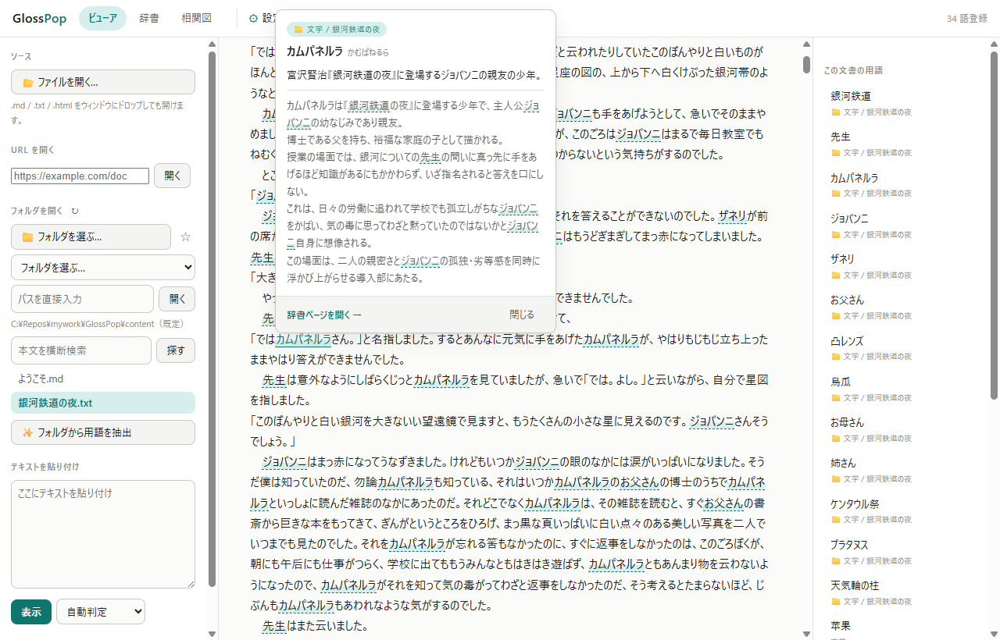

# GlossPop

Markdown / テキストをブラウザで読みながら、**知らない言葉を選択するだけで辞書に登録**できるビューア。
一度登録した語は以後の表示で自動的にリンクになり、ホバーで吹き出しが出て、そこから辞書ページへ飛べる。

```
テキスト表示 → 語を選択 → AI が下書き → 保存 → 以後は自動リンク＋吹き出し
```



> 画面はどれも、同梱の [`content/銀河鉄道の夜.txt`](content/銀河鉄道の夜.txt)（青空文庫）に
> 登場人物などを登録した状態。**この辞書は配布物には入っていない** —— 最初に入っているのは
> `ようこそ.md` 用の 3 語だけで、同じ状態は
> [まとめて登録](MANUAL.md#まとめて登録する)（✨ 用語を抽出）と
> [関係の下書き](MANUAL.md#関係を-ai-に下書きさせる)で作れる。

## できること

- **自動リンクと吹き出し** — 登録した語は本文で勝手にリンクになる。装飾やルビをまたいでも
  照合し、`pre` やコードの中は避ける（→ [自動リンクの規則](MANUAL.md#自動リンクの規則)）
- **AI が下書きする** — 選択した語の読み・別名・カテゴリ・要約・本文を Claude Code CLI か
  Gemini API に書かせて、直してから保存する（→ [ビューアで登録する](MANUAL.md#ビューアで登録する)）
- **まとめて登録** — 文書から辞書化する価値のある語を種別ごとに挙げさせて、選んだぶんだけ
  下書きする（→ [まとめて登録する](MANUAL.md#まとめて登録する)）
- **誰に解説してもらうかを選べる** — 「猫の語り手の口調で」「講談調で」と書いておけば、
  下書きがその調子になる。**語り手の顔**も置けて、吹き出しと用語ページに出る。
  どちらも**作品ごとに持てる**ので、小説と社内資料で切り替え直さずに済む
  （→ [ペルソナのレシピ](docs/voices.md)、実物は [samples/](samples/)）
- **関係と相関図** — 用語どうしの関係を書くと図になる。見せ方は 5 つ
  （→ [関係と相関図](MANUAL.md#関係と相関図)）
- **フォルダごとの辞書** — 小説の登場人物を全体の辞書に混ぜずに済む
  （→ [フォルダ辞書](MANUAL.md#フォルダ辞書ローカル辞書)）
- **ネタバレを防ぐ** — 初出の場面だけを AI に渡す。相関図でも判明位置つきの関係は伏せる
  （→ [ネタバレを防ぐ](MANUAL.md#ネタバレを防ぐ小説の人物辞書など)）


## ダウンロードして使う（Windows）

Python のインストールは要らない。

1. [Releases](https://github.com/lancard-aikawa/GlossPop/releases/latest) から
   `GlossPop-<version>-win-x64.zip` をダウンロードする
2. **展開する前に** zip を右クリック → プロパティ → 「セキュリティ: 許可する」に
   チェック（`Unblock-File .\GlossPop-*.zip` でも可）。署名していないので、これをしないと
   起動時に SmartScreen の警告が出る
3. 好きな場所に展開し、`GlossPop\glosspop.exe` を実行する
4. **専用ウィンドウが自動で開く**（タブもアドレスバーも無い。中身は Edge）
5. 一覧の `ようこそ.md` を開く。サンプルの用語が 3 語入っているので、そのまま
   自動リンクと吹き出し（同じ表記が 2 つの意味を持つ例も）を試せる
6. **AI に下書きさせるなら、別途 [Claude Code CLI](https://claude.com/claude-code) を
   入れて一度ログインする**（→ [AI について](#ai-についてclaude-code-cli-を強く推奨)）。
   入れなくても手で登録するぶんには動く

ウィンドウが開かないときは、ブラウザで **http://127.0.0.1:8765/** を開けばよい
（アプリモードで開ける Edge / Chrome が無い場合は既定のブラウザで開く）。

**終わるときはウィンドウを閉じるだけでよい。** 少し待ってサーバも自分で止まる
（開いているページから生存確認が届かなくなったら終わる）。専用ウィンドウが開いた
時点でコンソールは引っ込むので、閉じて回るものは残らない。

ブラウザで開いて使っているとき（`serve`）は止まらない。そちらは `Ctrl+C` で。

`glosspop.exe` だけ取り出しても動かない。`_internal\` と同じフォルダに置いたまま使うこと。
辞書は exe と同じ場所の `data\glossary\` に貯まるので、フォルダごとコピーすれば別の PC へ
そのまま持っていける。更新のしかたは
[リリースノート](packaging/release-intro.md)にある。変更履歴は [CHANGELOG.md](CHANGELOG.md)。

## ソースから動かす

```powershell
uv sync
uv run glosspop app     # 専用ウィンドウで開く
uv run glosspop serve   # 開くだけ (ブラウザは自分で) http://127.0.0.1:8765/
```

止め方・`check.cmd`・ビルド・リリースは [DEVELOP.md](DEVELOP.md)。

## AI について（Claude Code CLI を強く推奨）

下書き・抽出・関係の下書きには AI が要る。**[Claude Code CLI](https://claude.com/claude-code)
を入れて一度 `claude` でログインしておけば、GlossPop 側の設定は何も要らない**
（API キーも不要 —— CLI の認証をそのまま使う）。**exe 版に `claude` は同梱されない**ので、
使うなら別に入れること。

Gemini API も選べるが、**Google AI Studio で API キーを発行して ⚙ に貼る**必要がある。
その手順を踏める人向けなので、迷うなら Claude Code CLI にすること。

**どちらも無くても GlossPop は動く。** AI を使う機能だけが無効になり、手で書いて登録する
ぶんには支障はない（→ [使う AI](MANUAL.md#使う-aiモデルと思考の深さ)）。

## 資料

| | |
| --- | --- |
| [MANUAL.md](MANUAL.md) | 使いかたの全部（画面の操作、辞書の形、自動リンクの規則、設定、更新） |
| [docs/voices.md](docs/voices.md) | ペルソナ（口調と顔）のレシピ。青空文庫の作品別に、書くとよい指示 |
| [samples/](samples/) | GlossPop で作った辞書の実物。置いて開くだけで動く |
| [DEVELOP.md](DEVELOP.md) | ソースから動かす・ビルド・リリース・テスト |
| [CLAUDE.md](CLAUDE.md) | 設計の前提と、壊しやすい不変条件 |
| [docs/design-notes.md](docs/design-notes.md) | 設計判断と、採らなかった案 |
| [docs/open-questions.md](docs/open-questions.md) | 未解決・保留中のもの |
