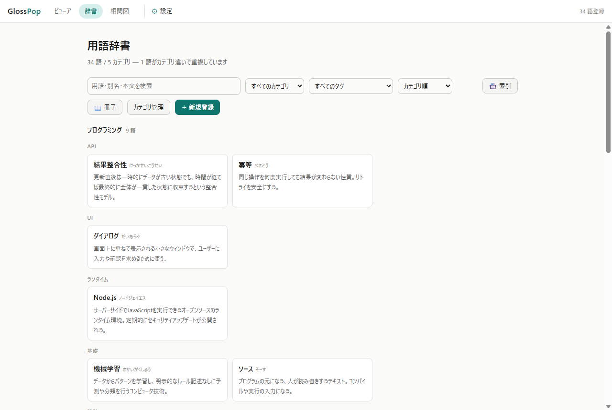
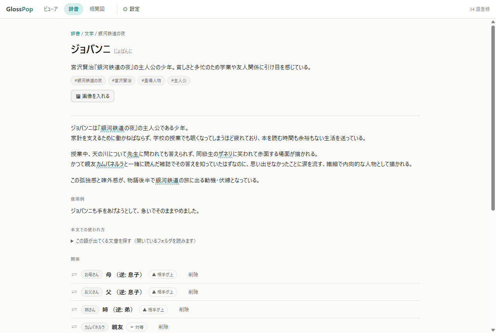
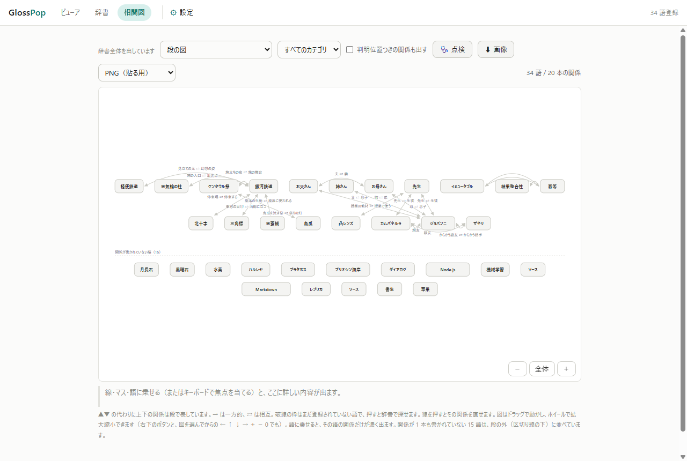
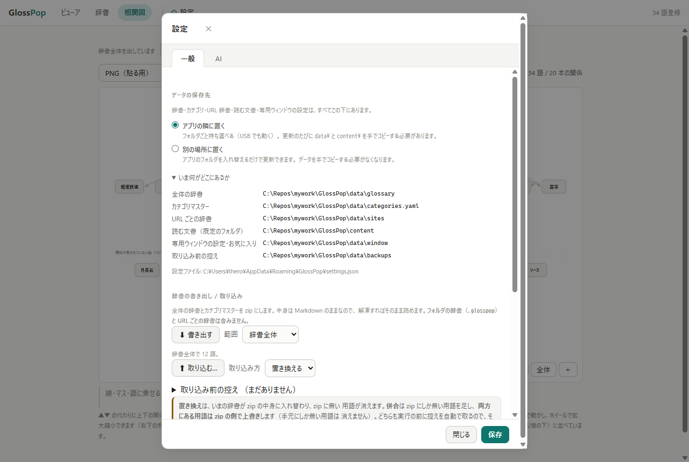

# 画面の棚卸し（UI 再構成の下ごしらえ）

> **これは変更前の記録。** 数字もスクリーンショットも 2026-08-09 の再構成の**前**の
> ものです。決めた規則は CLAUDE.md の「操作の置き場所は 5 つしかない」、
> なぜそうしたかは [design-notes](design-notes.md) の
> 「操作の置き場所を 5 つに決める」にあります。**このファイルは消さないこと** ——
> 規則の根拠になっている実測がここにしか無い。

**これは観察であって、判断ではない。** 何がどこにあるかを機械的に並べただけで、
「どれを消す・畳む・移す」はここには書いていない（それは頻度を知っている人が決める）。

再構成の手順は 4 段で、ここは **1 段目**:

1. **棚卸し** ← このファイル
2. **分類**（頻度 × その画面でしか出来ないか）—— 人が決める
3. **配置の規則を決めて CLAUDE.md に書く** —— 規則にしないと次に機能を足したとき同じ場所に戻る
4. 画面ごとに段階適用（`data-ref` を保てばスモークテストが守る）

先例がある。ビューアの左パネルは一度この形で解いた（「以前は 5 節が縦一列に並び、
フォルダ節だけが検索・一覧・抽出まで抱えていた」）。作り直しではなく、
**排他はタブ / 毎回でないものは畳む / 1 回きりはダイアログ / 読み方の設定は ⚙ へ**
という規則を決めて当てただけで、**開き方は 1 つも減らしていない**。

## 測り方

v0.14.0（2026-08-09）。実際にサーバを立てて Chrome で描かせ、
アクセシビリティツリーから操作を拾った（コードを読んだのではない）。
辞書は手元の `data/glossary` + `content/.glosspop`（**34 語 / 20 本の関係 / 5 カテゴリ**）。
窓は 1280×860。

## 数

| 画面 | 常時見えている操作 | 畳んである / ダイアログの中 | 状況で増えるもの |
| --- | --- | --- | --- |
| 辞書一覧 | **8** | 冊子 3 / カテゴリ管理 3 + 行ごと 4 | カードごとに 2 |
| 用語ページ | **16**（+ 関係の行ごとに「削除」） | 本文での使われ方 1 | 🗺 地図で見る、同名の別エントリ、カテゴリ移動パネル |
| 相関図 | **9** | 辺のダイアログ / 絵のダイアログ | 見せ方ごとに +1〜5 |
| ⚙ 設定 | **12**（一般）/ **15**（AI） | いま何がどこにあるか / 控えの一覧 | 保存先を「別の場所」にすると +1 |

---

## 1. 辞書一覧 `/glossary`

### 常時（ツールバー 1 行に 8 個）

| 操作 | 何ができる | ここにしか無い？ | 出方 |
| --- | --- | --- | --- |
| 検索欄 | 用語・別名・本文を絞る | ○ | 入力 |
| カテゴリで絞り込む | 6 択（`📁` 付きがローカル） | 相関図にも別のものがある | select |
| タグで絞り込む | **69 択** | ○ | select |
| 束ね方 | カテゴリ順 / 五十音順 / 作中の時刻順 | ○ | select |
| 📇 索引 | 語が本文のどこに何回出るか | ○ | 別ページ `/occurrences` |
| 📖 冊子 | 辞書を 1 枚にまとめて書き出す | ○ | ダイアログ |
| カテゴリ管理 | 追加・改名・削除・並べ替え | ○ | ダイアログ |
| ＋ 新規登録 | 用語を作る | 選択 → 登録 が別にある | ダイアログ・`.primary` |

### 畳んである / ダイアログの中

- **冊子ダイアログ** — 形式（md / html）、巻末索引を入れるか、⬇ 書き出す
- **カテゴリ管理ダイアログ** — どちらの辞書に作るか、新しい名前、＋ 追加、行ごとに ↑ ↓ / 改名 / 削除

### カードの中

- 見出しだけが本物のリンク。カード全体はクリックハンドラで飛ぶ（`<a>` にすると文字が選べないため）
- 選択 →「＋ 辞書に登録」（`select-add.js`。ビューア・用語ページと共用）

---

## 2. 用語ページ `/glossary/<ref>`

### 常時（16 個。上から順に）

| 位置 | 操作 | 種別 |
| --- | --- | --- |
| 見出し周り | パンくず（辞書 / カテゴリ）、タグ ×N | リンク |
| | 🖼 画像を入れる | ボタン |
| 本文での使われ方 | この語が出てくる文書を探す | **`
` で畳んである** |
| 関係の一覧 | 相手へのリンク ×6、削除 ×6 | リンク / ボタン |
| 関係を足す | 相手（combobox）、この語から見た一言、逆から見た一言 | 入力 3 |
| | 上下（4 択）、判明する位置、作中の時刻、関係を足す | 入力 3 + ボタン |
| 関係の下 | 相関図で見る → / この語を中心に → / ✨ この語の関係を下書き | リンク 2 + ボタン |
| 最下段 | 編集 / カテゴリを移動 / まとめる / 削除 / 一覧へ戻る | ボタン 4 + リンク |
| メタ行 | 保存先、初出リンク、出典、作成、更新 | テキスト + リンク |

### 状況で増えるもの

- 🗺 地図で見る（`pin` / `line` / `area` が書かれている語だけ）
- 同じ用語名の別カテゴリのエントリへのリンク
- 「カテゴリを移動」を押すと出る移動パネル

---

## 3. 相関図 `/graph`

### 常時（ツールバー 6 + 図の右下 3）

| 操作 | 何ができる | 出方 |
| --- | --- | --- |
| 見せ方 | 段の図 / 交差しない図 / 行列 / 中心の図 / 時系列 / 地図 | select（**覚える**） |
| カテゴリ | 5 択 | select |
| 判明位置つきの関係も出す | ネタバレを含む関係を出す | checkbox |
| 🩺 点検 | 別ページ `/doctor` | リンク |
| ⬇ 画像 | 図を書き出す | ボタン |
| 画像の形式 | PNG / SVG | select |
| − / 全体 / ＋ | 拡大縮小 | 図の右下に重ねたボタン |

### 見せ方によって増えるもの

| 見せ方 | 増えるもの |
| --- | --- |
| 時系列 | 軸（読む順 / 作中の時刻）、並べるもの（関係 / 語）、ここまで読んだぶん |
| 地図 | 絵の選択、絵を入れる / 消す、時刻スライダ、種別の宣言（点 / 線 / 領域）、↩ 戻す |
| 中心の図 | 中心の語 |

### 図の中

- 辺 = ボタン **20 本**（押すと編集ダイアログ）／ ノード = リンク **34 個**
- 一言 = 押せる（線と連動して光る。置けなかったものは畳まれている）
- 下に **詳細の枠**（高さ固定）と **凡例**

---

## 4. ⚙ 設定

タブ 2 枚（一般 / AI）。**フッタの「保存」は一般タブにだけ出る**（AI 側は自前の保存ボタンを持つ）。

### 一般（12）

| 節 | 中身 |
| --- | --- |
| データの保存先 | radio 2（アプリの隣 / 別の場所）+ `
` いま何がどこにあるか（6 項目 + 設定ファイルのパス） |
| 辞書の書き出し / 取り込み | ⬇ 書き出す + 範囲 select、⬆ 取り込む + 取り込み方 select、`
` 控えの一覧 |
| 表示 | テーマ、文字の大きさ、各用語の最初の 1 回だけリンクする |
| 更新の確認 | GitHub に聞くか |
| フッタ | 閉じる / 保存 |

### AI（15）

| 節 | 中身 |
| --- | --- |
| AI（下書き・抽出・関係） | 使う AI、モデル + 一覧を取り直す、思考の深さ、AI の設定を保存 |
| 文体（口調） | 効かせる範囲（全体 / 📁 このフォルダ）、指定の入力、プリセット 5 個、文体を保存 |
| 語り手の顔 | 全体・📁 このフォルダ で「選ぶ…」×2 |

文体と顔は **ビューアのサイドバーと同じ部品**（`ai-style.js`）。写しではない。

---

## 横断して見えたこと

判断は入れず、事実だけ。

### 1. 折り返しがグループを壊す

1280px の時点で、**辞書一覧のツールバーは 2 行に折り返している**。`spacer` があるので
1 行目の右端が 📇 索引、2 行目が 📖 冊子 / カテゴリ管理 / ＋ 新規登録 になり、
**「絞り込み」と「操作」の境目だったはずの空白が消えている**。

相関図はもっとはっきり出ていて、**⬇ 画像 と その形式の select が別の行に割れる**
（形式が何の形式なのか、並びからは読めない）。

CLAUDE.md の「ボタンの文字は折り返さない。幅は周りで吸収する」は守られている。
**折り返したあとの並びが決まっていない**、というのが今の状態。

### 2. タグの select が 69 個ある

34 語の辞書で **69 タグ、うち 58 個は 1 語にしか付いていない**。
select の選択肢としては開いた時点で読めない。

### 3. ツールバーの中身が状態で変わる（相関図だけ）

見せ方 6 通りで並ぶものが変わり、最少 6 個・最多 11 個。
ほかの 3 画面は固定なので、**相関図だけ「いま何ができるか」が動く**。

### 4. 凡例が 1 段落に 6 つの事実を詰めている

相関図の下の説明は 4 行の塊で、上下の意味・矢印の意味・破線の意味・線を押すと直せること・
操作方法・段の外の語の数、が句点で連なっている。毎回すべて読み直す形になっている。

### 5. 「書き出し」が 3 か所にある

📖 冊子（辞書一覧）／ ⬇ 画像（相関図）／ ⬇ 書き出す zip（⚙）。
**3 つとも隣に形式の select を持っている**が、置かれている場所も見た目も揃っていない。

### 6. 消える操作が普通のボタンと横一列にいる

用語ページの最下段は 編集 / カテゴリを移動 / **まとめる** / **削除** / 一覧へ戻る。
「まとめる」も片方のエントリが消える操作だが、並びからは読めない。

### 7. 主要操作の位置が画面ごとに違う

`.primary` が付いているのは辞書一覧の ＋ 新規登録（ツールバー右端）だけ。
用語ページにも相関図にも「この画面の主役」は無い。

### 8. 同じ行き先に複数の入口がある

相関図へは topbar / 用語ページの「相関図で見る」/「この語を中心に」/「🗺 地図で見る」の 4 つ。
**これは意図的なもの**（`?ref=` は中心の図で開く、など行き先が違う）が、
**画面からは同じ場所に見える**。

---

## どう決めたか（2〜4 段目・2026-08-09）

置き場所を 5 つに決め、**入口は 1 つも減らさずに**当てた。規則の正は
CLAUDE.md、判断と代償は [design-notes](design-notes.md)。

| 観察 | どうしたか |
| --- | --- |
| 1. 折り返しがグループを壊す | 辞書一覧を 8 → 6 に（索引・冊子・カテゴリ管理を ⋯ へ）。相関図はタブ化で 1 行に収めた |
| 2. タグの select が 69 個 | `<input list>` + `<datalist>`（打てば絞れて、空のまま開けば全部出る。件数も候補に残す） |
| 3. ツールバーの中身が状態で変わる | 見せ方をタブに。**タブ専用の操作はタブの下の行**へ移し、上の行は全タブ共通だけに |
| 4. 凡例が 1 段落に 6 つの事実 | **未着手**（今回の範囲外。文言の問題で、置き場所の問題ではない） |
| 5. 「書き出し」が 3 か所 | どれも ⋯ の中へ。形式はメニューの項目かダイアログで選ぶ（ボタンの隣に select を並べない） |
| 6. 消える操作が普通のボタンと横一列 | まとめる・削除を ⋯ の**区切り線の下**へ。外に残したのは「編集」だけ |
| 7. 主要操作の位置が画面ごとに違う | `.primary` は画面に 1 つまで（辞書一覧 = ＋ 新規登録、用語ページ = 編集、相関図 = 無し） |
| 8. 同じ行き先に複数の入口 | **名前と中身が反転していた**（「相関図で見る」がカテゴリ全体、「この語を中心に」がその語）。**この語の図はタブへ**、カテゴリ全体は中身を言う名前のリンクに分けた |

そのほか、用語ページの「関係を足す」（入力 7 個）は `
` に畳んだ（開閉は覚える）。

そのうえで**場所そのものを 1 つにした**（同日・2 段目）。topbar の「相関図」を外し、
**一覧も含めた 7 つを辞書のタブ**に、用語ページも **辞書 / この語の図 / 🗺 地図** の
タブにしてある（**その後、地図は列から外した** —— 出すのは絵 1 枚の上なので、
辞書ぜんぶの見方とは範囲が違う。いまは図の ⋯ と用語ページの 🗺 から開く）。これで観察 2（「相関図」という総称）も解けた —— 総称が要らなくなった。
→ [design-notes](design-notes.md) の「一覧も『見方』の 1 つ」。
